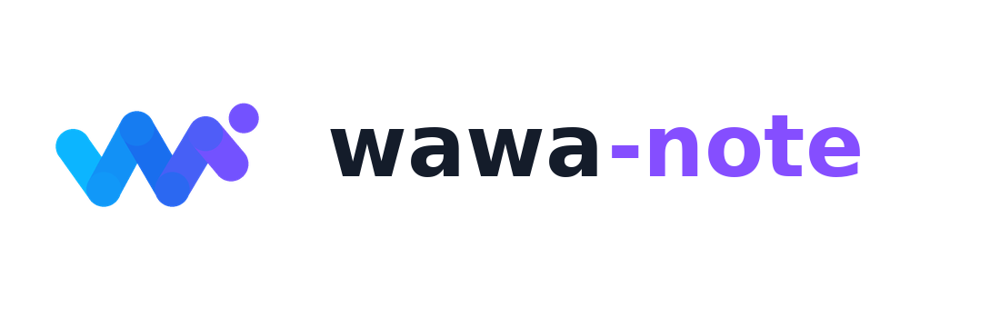

<p align="center">
  
</p>

<p align="center">
  <strong>Your Knowledge, Your Process.</strong><br>
  <sub>An open-source, provider-agnostic AI workspace for project memory. Free. No SaaS. Your data, your rules.</sub>
</p>

<p align="center">
  <a href="https://github.com/wsmontes/wawa-note-ios/releases"></a>
  <a href="LICENSE"></a>
  
  
</p>

---

# Wawa Note

**Your Knowledge, Your Process.**
An open-source, provider-agnostic AI workspace for project memory. Free. No SaaS. Your data, your rules.

[](https://github.com/wsmontes/wawa-note-ios/releases) [](LICENSE)   [](https://github.com/wsmontes/wawa-note-ios/actions)

> ⚠️ **Status: Early development.** The app builds and core features work, but it has not been validated through sustained daily use. Expect rough edges. See [Known Limitations](#known-limitations) below.

---

## What is Wawa Note?

Wawa Note captures meeting evidence — audio, scans, links, notes — and transforms it into a **project knowledge store** with typed graphs, tasks, decisions, and provenance trails. An agentic AI chat navigates your knowledge like a filesystem.

**You own your data. You choose your AI provider. You control the process.**

- **No SaaS.** There are no Wawa Note servers. The app never sees your data.
- **No vendor lock-in.** Export everything. Import everything. Your knowledge is portable.
- **Pay for what you use.** Wawa Note is free. You bring your own API keys.
- **Go fully local if you want.** On-device transcription. Local LLMs via LM Studio, Ollama, or your internal network.

---

## Core Features

### Capture
- **Audio recording** with on-device (Apple Speech) or remote (Whisper API) transcription
- **Document scanning** via VisionKit (multi-page OCR)
- **Note creation** with markdown support
- **Web bookmarks** and **file import** (JSON, Markdown, ICS, SRT, PDF, HTML, RTF)
- **Share Extension** — send content directly from any app

### Intelligent Pipeline
- Extract → Analyze → Detect signals → Ingest — fully automated per item
- Agent-driven processing with retry logic and background task support
- Framework-based analysis (Meeting, Research, Blank — adapts output schema to project type)

### Agentic Chat
- **Shell VFS for tool calling** — the AI navigates your knowledge using Unix-like commands (`ls`, `cd`, `cat`, `find`, `grep`, `touch`, `echo`, `mv`, `rm`)
- Context-aware conversations scoped to projects, items, or global
- Auto/Deep/Fast modes — control how much the agent iterates
- Voice input via on-device speech recognition or Whisper
- Swipe actions on task/item cards for quick status changes
- Choice prompts — numbered options become tappable buttons

### Project Intelligence
- Task boards with status, priority, owner tracking
- Graph view — typed relationships with evidence provenance
- Timeline — calendar integration with day summaries
- Project health metrics and signals

### iOS Integrations
- Calendar read/write
- Reminders export
- Core Spotlight indexing
- Face ID biometric gate
- Live Activities during recording

---

## Architecture

```
┌──────────────────────────────────────────────────────────┐
│  iOS App (SwiftUI)                                       │
│  Capture │ Inbox │ Explore │ Chat                        │
├──────────────────────────────────────────────────────────┤
│  Domain Layer                                            │
│  Agent (Shell VFS + Tool Calling) │ Content Pipeline     │
│  Project Models │ Graph │ Calendar │ Search              │
├──────────────────────────────────────────────────────────┤
│  Provider Abstraction                                    │
│  OpenAI │ Anthropic │ Gemini │ DeepSeek │ Local LLM     │
├──────────────────────────────────────────────────────────┤
│  Storage                                                 │
│  SwiftData (metadata) │ FileManager (artifacts)          │
│  Keychain (API keys)  │ Spotlight (indexing)             │
└──────────────────────────────────────────────────────────┘
```

### Key Design Decisions

- **Shell VFS for tool calling**: Instead of dozens of individual AI tools, the agent uses a single `run_command` with Unix-like shell commands. This replaced 47 individual tool files, making the agent more flexible and reducing maintenance.
- **Protocol-first boundaries**: Every external dependency (AI providers, transcription engines, import/export formats) is behind a Swift protocol.
- **No backend**: Fully local. No servers, no cloud sync, no accounts.
- **Provenance on every edge**: Graph relationships are traceable to a transcript segment, note block, or external event.
- **Centralized AI config**: All AI calls go through `AIConfigService.shared.requestParams(for:model:)` — handles reasoning model detection, temperature capping, and context window limits.

---

## Quick Start

### Requirements

- Xcode 16+
- iOS 17.0+
- iPhone (or iPad / Mac with Catalyst)
- An API key for at least one AI provider (OpenAI, Anthropic, Gemini, DeepSeek, or any OpenAI-compatible endpoint)

### Setup

```bash
git clone https://github.com/wsmontes/wawa-note-ios.git
cd wawa-note-ios
open wawa-note.xcodeproj
```

1. Select your development team in Signing & Capabilities
2. Build and run (Cmd+R) on a device or simulator
3. Go to Settings → Provider → Add your API key
4. Start capturing: record audio, scan a document, or create a note

### Provider Configuration

| Provider | What You Need |
|----------|---------------|
| **OpenAI** | API key + base URL (default: `https://api.openai.com/v1`) |
| **Anthropic** | API key + base URL |
| **Gemini** | API key + base URL |
| **DeepSeek** | API key + base URL |
| **OpenAI-compatible** | API key + your own endpoint (Ollama, vLLM, Groq, etc.) |
| **Local LLM** | Endpoint URL only (e.g., `http://localhost:8080/v1`) |

All providers configured via `wawa-note/Providers/ai_config.json`.

---

## Project Structure

```
wawa-note/
├── App/                    # App entry point
├── Audio/                  # Recording, playback, session management
├── Connectivity/           # Recording coordinator
├── ContextCapture/         # Calendar, location, focus sensors
├── Domain/
│   ├── Agent/              # AgentLoop, ShellInterpreter, ShellTool, ToolContext
│   ├── Calendar/           # Calendar sync, timeline, day summaries
│   ├── Models/             # KnowledgeItem, Project, Task, Person, GraphEdge, Chat
│   └── Services/           # Content pipeline, search, project services
├── Ecosystem/
│   ├── Export/             # Markdown, JSON, SRT, CSV, Graph exporters
│   ├── Import/             # 10 format importers + import router
│   └── Spotlight/          # Core Spotlight indexing
├── LocalIntelligence/      # Embeddings, semantic search (partially wired)
├── Providers/              # AIProvider protocol + OpenAI, Anthropic, Gemini adapters
├── Security/               # Biometric gate, secure keychain
├── Storage/                # File artifact store, keychain wrapper
├── Transcription/          # Apple Speech + remote transcription engines
├── UI/                     # All SwiftUI views
│   ├── Capture/            # Scanner, recording UI
│   ├── Chat/               # Chat view, blocks, parser, view model
│   ├── Components/         # ContentView, shared components
│   ├── Explore/            # Project explorer
│   ├── Inbox/              # Universal search + triage
│   ├── Knowledge/          # Item detail, connections
│   ├── Project/            # Project detail, timeline, graph, tasks
│   └── Settings/           # Provider picker, config
└── Utilities/              # Logging, design tokens
```

---

## Configuration

### AI Config (`Providers/ai_config.json`)

```json
{
  "modelPresets": {
    "claude-sonnet-4-6": {
      "contextWindow": 200000,
      "maxOutputTokens": 64000,
      "reasoningModel": false,
      "supportsTemperature": true
    }
  },
  "features": {
    "chat": {
      "defaultModel": "claude-sonnet-4-6",
      "temperature": 0.7
    }
  }
}
```

### Permissions

All optional — the app works without them with reduced functionality:

- **Microphone** — audio recording
- **Speech Recognition** — on-device transcription
- **Camera** — document scanning
- **Calendar** — calendar integration
- **Location** — context sensing (optional)
- **Notifications** — Live Activities (optional)

---

## Development

### Building

```bash
git clone https://github.com/wsmontes/wawa-note-ios.git
cd wawa-note-ios
open wawa-note.xcodeproj
# Select team in Signing & Capabilities, then Cmd+R
```

### Key Principles

1. Protocol-first boundaries — every integration is behind a protocol
2. No hardcoded API keys, provider URLs, or secrets
3. Keychain for API keys, FileManager for artifacts, SwiftData for metadata
4. Keep SwiftUI views thin — services testable without UI
5. `AIConfigService.shared.requestParams(for:model:)` for ALL AI requests
6. Provider-specific JSON stays inside provider implementations

### Running Tests

```bash
xcodebuild test -project wawa-note.xcodeproj -scheme wawa-note -destination 'platform=iOS Simulator,name=iPhone 16'
```

### Architecture Docs

- [docs/DECISIONS.md](docs/DECISIONS.md) — Architecture decision records
- [docs/CODING_STANDARDS.md](docs/CODING_STANDARDS.md) — Conventions and rules

---

## What's Next

Priority order based on current gaps:

1. **Dogfooding** — daily use with real data to validate the pipeline and graph quality
2. **Device testing** — validate on iPhone 14 Plus hardware
3. **Integration tests** — cover the agent loop, shell interpreter, and pipeline
4. **Error recovery UX** — clear retry/skip paths for pipeline failures
5. **Wire semantic search** — make embeddings queryable in the chat

---

## License

MIT — see [LICENSE](LICENSE) for details.

Wawa Note is **provider-agnostic** and does not bundle any AI provider SDKs. Provider integrations are implemented against public REST APIs.

---

<p align="center">
  <sub>Built with ❤️ by <a href="https://github.com/wsmontes">@wsmontes</a></sub>
</p>
