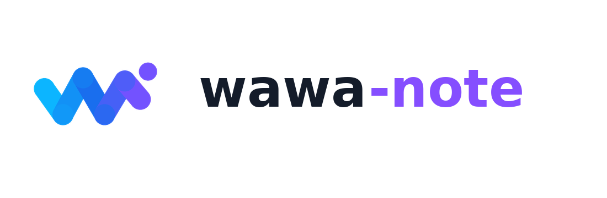

<p align="center">
  
</p>

<p align="center">
  <strong>Capture. Find. Keep related work together.</strong><br>
  <sub>A local-first iPhone workspace for recordings, notes, scans, and imports.</sub>
</p>

<p align="center">
  <a href="LICENSE"></a>
  
  
</p>

> **Status:** Wawa Note 1.0 is a release candidate undergoing final device and App Store validation.

## What Wawa Note does

Wawa Note collects the source material behind your work in one searchable, on-device library:

- record meetings and conversations you choose to capture;
- transcribe with Apple Speech on device by default;
- scan multi-page documents with VisionKit OCR;
- create notes and web bookmarks;
- import PDF, Markdown, JSON, HTML, RTF, ICS, SRT, and other supported files;
- receive compatible content through the Share extension;
- find and triage everything from Inbox;
- group related source items into simple projects in Explore;
- export your data when you want to use it elsewhere.

The shipping interface has three tabs: **Capture**, **Inbox**, and **Explore**. Experimental Chat, graph, task-board, and project-health code is not exposed in the 1.0 product.

## Privacy model

The local library is stored on the iPhone with SwiftData and file storage. API keys are stored in the iOS Keychain. Wawa Note has no account, advertising, analytics, tracking, or Wawa Note cloud backend.

Cloud AI is optional. A configured cloud provider cannot receive personal content until the user accepts a provider-specific, off-by-default sharing approval. Local capture, organization, OCR, search, export, and on-device Apple Speech do not require a cloud AI provider.

Read the complete [Privacy Policy](PRIVACY.md) or visit [Support](SUPPORT.md).

## Optional AI services

Wawa Note can use a user-supplied credential for supported REST APIs, including OpenAI, Anthropic, Google Gemini, DeepSeek, Groq, and compatible custom endpoints. It can also connect to compatible models on a computer the user controls, such as LM Studio or Ollama.

Approved providers can support transcription, summaries, structured analysis, and embeddings. Provider costs, retention, availability, and terms belong to the selected provider; no credential is bundled in the app.

## Architecture

```text
Capture ─┐
Inbox ───┼─> KnowledgeItem library ─> Projects (item collections)
Explore ─┘          │
                    ├─ SwiftData metadata
                    ├─ File artifacts (audio, scans, transcripts)
                    ├─ Apple Speech / Vision OCR
                    └─ Optional consent-gated AIProvider
```

Important boundaries are protocol-first:

- `AIProvider`
- `TranscriptionEngine`
- `FormatImporter`
- `FormatExporter`
- `ContextSensor`

Every AI request uses the centralized `AIConfigService` request policy. Provider-specific formats stay inside provider adapters. Large artifacts remain files; indexable records remain SwiftData metadata.

## Repository layout

```text
WawaNoteCore/        Shared framework used by the app and Share extension
wawa-note/
  App/               App entry point and persistence setup
  Audio/             Capture, playback, session, and file writing
  ContextCapture/    Optional Apple-framework context sensors
  Domain/            Models, services, projects, calendar, and dormant agent code
  Ecosystem/         Import, export, Spotlight, and integration services
  LocalIntelligence/ Embedding and semantic-search infrastructure
  Providers/         AI provider protocol and adapters
  Storage/           Artifact storage and Keychain access
  Transcription/     Apple and optional remote transcription engines
  UI/                Capture, Inbox, Explore, item detail, and Settings
wawa-note-share/     iOS Share extension
wawa-noteTests/      Unit and integration-oriented service tests
docs/                Architecture, security, decisions, and release documentation
scripts/             Build, device, logging, and JIRA automation
```

The Watch targets remain in the repository but are deliberately not embedded in the 1.0 iPhone archive. They require paired-device validation before a later release.

## Build and test

Requirements:

- Xcode 26.5 or newer
- iOS 17.0 deployment target
- an Apple development team for device signing

```bash
make quick          # build and run the automated test suite
make deploy         # build and install on the primary iPhone 14 Plus
make all            # build, install, and test
make logs           # stream primary-device logs
make bug-report since=1h
```

Device identities live in `scripts/device-config.sh`. See `AGENTS.md` for the complete workflow and repository rules.

## Project documentation

- [Architecture decisions](docs/DECISIONS.md)
- [Implementation plan](docs/IMPLEMENTATION_PLAN_V2.md)
- [Coding standards](docs/CODING_STANDARDS.md)
- [Provider contracts](docs/API_PROVIDER_CONTRACTS.md)
- [Security and privacy design](docs/SECURITY_PRIVACY.md)
- [App Store metadata](docs/app-store-metadata.md)
- [App privacy questionnaire](docs/privacy-nutrition-labels.md)

## License

Wawa Note is available under the [MIT License](LICENSE). Provider integrations use public HTTP APIs rather than bundled provider SDKs.
