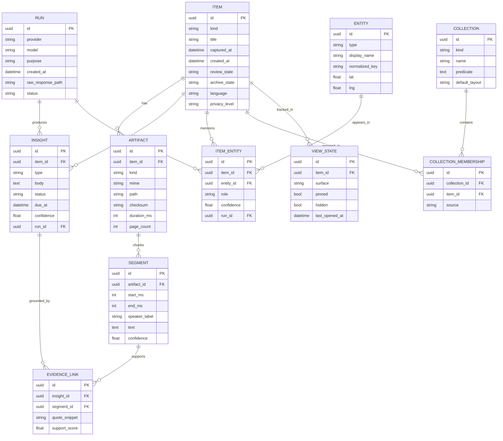
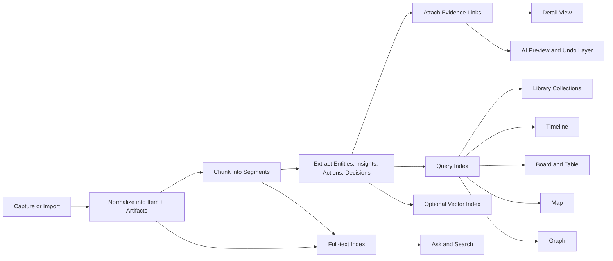

# Interface Frameworks for Wawa-note

## Executive summary

The main pattern across the champion apps is that each one is excellent not because it has “more features,” but because it chooses a different **primary object** and then optimizes the entire interaction model around that object. Superhuman treats a message thread as a queue item to process; Google Photos treats media as an ever-growing archive to retrieve; Readwise Reader treats the document as a detail surface to read and annotate; Trello centers the card; Airtable the record; Day One the dated entry; Google Maps the place; Obsidian the linked note; Miro the spatial object on a canvas; Raycast the command; and Notion demonstrates how one underlying dataset can be projected into multiple views without forking the data. citeturn24view0turn24view1turn25view0turn25view1turn26view0turn26view1turn28view0turn29view0turn31view0turn33view0turn34view0turn36view0turn37view0turn38view0

For wawa-note, that means the next step should not be “find the one winning interface.” It should be to build a **small core stack of complementary frameworks**: an **Inbox/Queue** for triage, a **Library/Archive** for retention, a **Reader/Detail** view for inspection and evidence, a **Timeline/Stream** for memory and revisit, and a **Conversational/Command** layer for retrieval and action. Existing Kanban/action-item surfaces should remain available, but as one projection among many rather than the app’s mental model. Airtable- and Notion-style multi-view architecture is the right shell for that strategy. citeturn24view0turn24view3turn25view0turn25view2turn26view0turn27view0turn31view0turn31view1turn37view0turn38view0turn38view2

The strongest transferable architectural idea is **one canonical corpus, many projections**. Airtable views all sit on the same records; Notion views all sit on the same database pages; Readwise distinguishes Feed from Library but still organizes with queries and filtered views; Day One and Google Photos keep the archive stable while exposing derived memories, collections, and filters. Wawa-note should do the same: store one canonical item and derive queue state, archive state, table rows, board cards, map pins, graph nodes, and AI answers from it. citeturn29view0turn29view1turn29view2turn30view2turn38view0turn38view1turn38view2turn26view1turn26view2turn31view3turn25view1turn25view2

AI is most useful when it sits **on top of explicit objects and explicit evidence**. Superhuman AI drafts, labels, reminds, and summarizes; Google Photos’ Ask Photos adds multimodal natural-language retrieval; Raycast AI can invoke installed extensions; Airtable AI operates at the field level; Readwise Ghostreader chats with the current document. Those are all powerful, but they also show the same product risk: if the system acts without clear provenance, preview, and undo, trust drops quickly. citeturn24view2turn25view3turn12search9turn37view2turn18search16turn27view1

On iPhone, the winning pattern is consistency and progressive disclosure, not maximal density. Apple’s HIG still points in the same direction: use tab bars for section navigation, search fields as a familiar entry point, lists and tables for grouped or hierarchical data, and accessibility as a baseline rather than a final polish pass. citeturn14search5turn14search16turn14search3turn14search1

## Champion frameworks

The table below synthesizes the official product documentation for each champion. Where the table assigns a lesson or a risk, that is an analytical inference from the documented interaction model.

| Framework and champion | What the UI is optimized around | Ingestion, review, organization, retrieval | Why it feels fast and clear | Where it breaks, how AI helps or harms, and what wawa-note should transfer |
|---|---|---|---|---|
| **Inbox/Queue — Superhuman** citeturn24view0turn24view1turn24view2turn24view3 | A **conversation thread** as a thing awaiting a decision. The data-model bias is toward **state**: unread, important, other, snoozed, reminded, split. | Review happens through Split Inboxes with visible counts, Important/Other, and mastery via Superhuman Command on desktop and mobile. Search and command are first-class, and mobile mirrors the model with pull and two-finger gestures instead of a miniature desktop UI. | It is fast because it keeps the user in one queue, exposes counts, hides empty splits, and centralizes actions behind `Cmd/Ctrl+K`. Superhuman even recommends keeping split inboxes to no more than seven. | It breaks when the queue becomes taxonomy, when classification is wrong, or when AI auto-actions feel too opaque. AI helps with reminders, labels, drafts, and summaries; it harms when it silently misclassifies or raises privacy concerns. **Transfer:** make “new stuff” a temporary, decisional surface, not the archive. |
| **Library/Archive — Google Photos** citeturn25view0turn25view1turn25view2turn25view3turn22search6turn22search16 | A **media item** in a persistent archive. The data-model bias is toward **retention at scale** with rich hidden metadata. | Ingestion is passive and continuous through backup. Review happens through Photos view, Memories, Albums, Documents, People & pets, Places, Favorites, and Archive. Retrieval relies on simple search, semantic grouping, and natural-language Ask Photos. | It is clear because manual filing is optional. Archive removes clutter from the main stream while leaving items in albums and search. Volume handling is exceptional because semantic retrieval and collections absorb growth; Google says more than 6 billion photos are uploaded every day. | It breaks when ranking or semantic grouping is wrong and when the hidden AI model feels inscrutable. AI helps with natural-language retrieval and task-like recall; it harms when users cannot predict why something appeared. **Transfer:** make wawa-note easy to save first and organize later; keep archive stable and expose derived collections. |
| **Reader/Detail — Readwise Reader** citeturn26view0turn26view1turn26view2turn26view3turn27view0turn27view1turn27view2 | A **document** meant to be read, highlighted, annotated, and revisited. The data-model bias is toward **artifact + annotations + metadata**. | Reader separates **Feed** from **Library** and then further separates Inbox/Later/Archive/Shortlist. Ingestion comes from browser extension, share sheet, drag-and-drop files, RSS, email newsletters, podcasts, and more. Retrieval is split between full-text search and query-based filtered views. | It feels fast because the detail page is the product: keyboard-first reading, quick highlight/tag/note actions, in-document find, offline full-text search, and AI chat on the selection or whole document. The Daily Digest is also a strong mobile review loop. | It breaks when the saved corpus grows faster than the curation rhythm, or when AI chat distracts from the source text rather than helping interpretation. AI helps with contextual explanation and summarization; it harms if it becomes a substitute for grounded reading. **Transfer:** every important item in wawa-note needs a strong detail page with transcript, source artifacts, evidence-backed insights, and in-context AI. |
| **Card Board — Trello** citeturn28view0turn28view1turn28view2turn28view3turn17search14turn17search17 | A **card in a list on a board**. The data-model bias is toward **workflow status** and medium-granularity work objects. | Ingestion can be manual or by email to a board or inbox, including AI-generated summaries and checklists from email. Review happens by scanning columns and opening the card back for details, attachments, comments, labels, dates, checklists, mirrors, and automations. | It is clear because board front and card back separate quick scanning from deep detail. It is fast because moving a card communicates progress immediately, and automations can mutate cards on triggers or schedules. The newer card back explicitly aims to reduce screen clutter. | It breaks when boards become dumping grounds, when everything is flattened into a “card,” or when rich context gets buried behind status columns. AI helps when it turns unstructured email into a draft card with dates and checklists; it harms when nuance is prematurely converted into tasks. **Transfer:** keep board views derived and optional; do not let the card become the only thing the system can understand. |
| **Table/Database — Airtable** citeturn29view0turn29view1turn29view2turn29view3turn30view0turn30view2turn18search16 | A **record with fields and relationships**. The data-model bias is toward **explicit schema** and relational integrity. | Airtable can present the same table as grid, form, calendar, gallery, kanban, timeline, list, and gantt. Interfaces are crucial because they section the underlying data into smaller, role-specific surfaces, including record review and record detail pages with comments, linked records, buttons, and workflow steppers. | It is powerful because linked records and lookup fields encode structure explicitly, while interfaces hide unnecessary columns and expose only the relevant action surface. Mobile interfaces keep search, filters, list/gallery/calendar/kanban, and record actions available without showing the whole schema. | It breaks when teams surface raw tables to casual users, over-model before they understand the domain, or proliferate fields faster than meaning. AI helps when field agents extract, classify, or generate at the cell level; it harms when low-trust values get written into authoritative fields. **Transfer:** use tables as a power-user projection and use interfaces as the default mobile surface. |
| **Timeline/Stream — Day One** citeturn31view0turn31view1turn31view2turn31view3turn32view0turn32view1turn32view2 | A **dated entry**. The data-model bias is toward **time, place, media, and reflection**. | Ingestion supports text, media, audio, imported content, and sync. Review happens through List, Calendar, Media, and Map views, plus On This Day and search/filters. Export is strong, with JSON, PDF, Markdown, and tagged/date-bounded flows. | It feels clear because chronology is a low-cognitive-load organizer. “On This Day” turns old data into a new review surface. Media and map views let the same entry corpus be re-entered through different cues without abandoning the timeline model. | It breaks when time becomes the only organizing principle and cross-cutting themes become hard to retrieve. AI-like transcription and reflection features help; over-personalized “memory surfacing” can feel uncanny or intrusive. **Transfer:** give every wawa-note item a temporal anchor and a revisit loop, but do not rely on time as the only index. |
| **Spatial Map — Google Maps** citeturn33view0turn33view1turn33view2turn33view3 | A **place** or **route**. The data-model bias is toward **coordinates, lists, and route context**. | Ingestion comes from search, saving places, adding notes, making lists, inviting collaborators, and route planning. Retrieval is spatial first: nearby saved, recently saved, route search, and layers. Lists are collaborative and can be shown or hidden on the main map. | It feels powerful because spatial memory is preattentive: the user often remembers *where* before they remember *what*. Nearby saved and recently saved are strong mobile adaptations, and searching along a route turns navigation into contextual retrieval. | It breaks when data is not truly place-based or when map clutter overwhelms the user. AI-like language search helps when place is the primary dimension; it harms when the system infers location or relevance too aggressively from weak signals. **Transfer:** spatial views should exist in wawa-note, but only for items with genuine place semantics. |
| **Graph/Network — Obsidian** citeturn34view0turn35view0turn35view1turn34view2turn34view3 | A **note node connected by links**. The data-model bias is toward **edges and adjacency** rather than chronology or status. | Obsidian’s graph shows notes, links, tags, attachments, groups, and local depth. Backlinks and local graph provide a more practical entry point than the full-vault graph. Search operators and YAML properties reinforce the graph with filters and typed metadata. | It is useful when the object network itself matters, especially in local graph form where depth and context are controlled. It also stays portable because properties are stored in YAML and links are first-class. | It breaks as a default home because global graphs become hairballs quickly. AI can suggest links and cluster related notes, but hallucinated or low-confidence edges are dangerous if displayed as truth. **Transfer:** give wawa-note a **local graph** with typed and evidence-backed edges; avoid a graph-first home screen. |
| **Canvas/Workspace — Miro** citeturn36view0turn36view1turn36view2turn36view3turn11search3 | A **spatial object on an infinite canvas**. The data-model bias is toward **layout, grouping, and synthesis**. | Ingestion is manual and collaborative: sticky notes, text, shapes, files, comments, connector lines, frames, and imported boards. Review happens through navigation, frames, attention management, comments, and grouping. | It shines when users need to think by arranging and comparing. Frames, grouping, alignment, and connector lines are essential because the underlying canvas is intentionally unconstrained. On desktop and tablet that creates freedom; on phone it quickly becomes fragile. | It breaks when infinite space becomes infinite clutter. Miro’s own docs note limited mobile support for major features like templates, export, presentation mode, video chat, and voting. AI can cluster and summarize a board, but it can also generate sprawling messes. **Transfer:** treat canvas as a synthesis mode for iPad/Mac and as a derivative workspace, not the canonical home of data. |
| **Conversational/Command — Raycast** citeturn37view0turn37view1turn37view2turn37view3turn12search2turn12search9 | An **intent** that resolves into a result and then into an action. The data-model bias is toward **commands, ranking, aliases, and action surfaces**. | Everything begins in one search bar. Root Search spans applications, files, commands, quicklinks, snippets, AI commands, scripts, settings, and URLs; the Action Panel then exposes context-sensitive actions. Quicklinks and aliases turn repeated intent into one-step commands. | It feels fast because it collapses navigation into one box, uses fuzzy search, learns ranking with frecency, and lets the user act immediately from the result list. Contextual actions reduce screen-hopping. | It breaks when touch-first users lack discoverability or when AI crosses the line from “help me decide” to “act without showing me options.” Raycast’s AI can chat and use extensions, but its own privacy docs emphasize explicit invocation and no background monitoring. **Transfer:** wawa-note should have a universal ask/command layer with previews, aliases, and reversible actions. |
| **Multi-view shell — Notion** citeturn38view0turn38view1turn38view2turn38view3 | A **database page** seen through many projections. The data-model bias is toward **one shared record, many layouts**. | The same database can appear as table, list, board, timeline, calendar, gallery, chart, and dashboard. Relations and rollups connect databases. Pages can open in side peek, center peek, or full page; dashboard views can combine multiple widgets around one dataset. | It stays practical because it doesn’t ask one view to do everything. Instead, it formalizes the idea that different cognitive jobs deserve different surfaces while preserving one source of truth. | It breaks when view sprawl and schema creep outpace governance. AI agents that generate dashboards are useful as scaffolding, but still need user curation. **Transfer:** this is the best meta-champion for wawa-note: one corpus, multiple projections, shared filters, and view-specific open modes. |

The deepest common lesson is that each champion **removes one kind of user decision from the critical path**. Superhuman removes “where do I go next?”; Google Photos removes “where do I file this?”; Readwise removes “where do I inspect evidence?”; Trello removes “what stage is this in?”; Airtable removes “what relates to what?”; Day One removes “when did this happen?”; Maps removes “where was this?”; Obsidian removes “what links here?”; Miro removes “what shape should thinking take right now?”; and Raycast removes “where in the app hierarchy is that command?” Notion then shows how these can coexist without duplicate data. citeturn24view0turn25view1turn27view0turn28view0turn29view2turn31view1turn33view1turn35view0turn36view1turn37view0turn38view2

## Comparison, taxonomy, and combinations

The scoring below is a product judgment, not an official vendor score. It is use-case agnostic and relative. Higher numbers mean “more of the named property”; for **cognitive load**, **overwhelm risk**, and **curation need**, lower is better.

**Comparison matrix**

| Framework | Cognitive load | Speed | Depth | Volume handling | Mobile suitability | Desktop suitability | AI suitability | Overwhelm risk | Curation need | Combinability |
|---|---:|---:|---:|---:|---:|---:|---:|---:|---:|---:|
| Inbox/Queue | 2 | 5 | 2 | 4 | 4 | 5 | 4 | 2 | 2 | 5 |
| Library/Archive | 2 | 4 | 2 | 5 | 5 | 4 | 5 | 2 | 2 | 5 |
| Reader/Detail | 3 | 4 | 5 | 3 | 4 | 5 | 5 | 3 | 3 | 5 |
| Card Board | 3 | 3 | 3 | 3 | 3 | 4 | 3 | 3 | 3 | 4 |
| Table/Database | 4 | 3 | 5 | 5 | 3 | 5 | 5 | 4 | 4 | 5 |
| Timeline/Stream | 2 | 4 | 3 | 4 | 5 | 4 | 3 | 2 | 2 | 4 |
| Spatial Map | 3 | 3 | 3 | 4 | 4 | 4 | 4 | 3 | 3 | 4 |
| Graph/Network | 4 | 2 | 5 | 2 | 2 | 4 | 4 | 5 | 4 | 3 |
| Canvas/Workspace | 4 | 3 | 5 | 2 | 1 | 5 | 4 | 5 | 4 | 3 |
| Conversational/Command | 3 | 5 | 4 | 5 | 3 | 5 | 5 | 2 | 1 | 5 |
| Multi-view shell | 3 | 4 | 4 | 4 | 4 | 5 | 4 | 3 | 3 | 5 |

**Ranked lists**

| Rank | General usefulness for wawa-note | Mobile usefulness | AI-powered usefulness |
|---:|---|---|---|
| 1 | Library/Archive | Library/Archive | Conversational/Command |
| 2 | Reader/Detail | Timeline/Stream | Reader/Detail |
| 3 | Inbox/Queue | Inbox/Queue | Library/Archive |
| 4 | Conversational/Command | Reader/Detail | Table/Database |
| 5 | Timeline/Stream | Spatial Map | Inbox/Queue |
| 6 | Table/Database | Conversational/Command | Timeline/Stream |
| 7 | Card Board | Card Board | Spatial Map |
| 8 | Spatial Map | Table/Database | Card Board |
| 9 | Graph/Network | Graph/Network | Graph/Network |
| 10 | Canvas/Workspace | Canvas/Workspace | Canvas/Workspace |

I do **not** rank the Notion-style multi-view shell against the ten concrete frameworks because it is better treated as an architectural layer that composes them rather than as a single everyday view. Notion’s core lesson is that the same record should be viewable in multiple layouts and open modes without being duplicated. citeturn38view0turn38view1turn38view2turn38view3

**Taxonomy of frameworks**

| Family | Frameworks | Dominant question | Object bias | Strongest use in wawa-note |
|---|---|---|---|---|
| Triage | Inbox/Queue | What needs attention now? | Stateful item | New captures, unresolved imports, AI suggestions |
| Retention | Library/Archive | What do I have and how do I get back to it? | Persistent artifact | Main saved corpus |
| Inspection | Reader/Detail | What exactly is in this thing? | Document/detail bundle | Transcript, evidence, summary, attachments |
| Orchestration | Card Board, Table/Database | What should happen next, and how is work structured? | Card or record | Derived action/project surfaces |
| Memory | Timeline/Stream | When did this happen? | Dated entry | Recall, revisit, longitudinal context |
| Exploration | Spatial Map, Graph/Network | Where is it? What connects to it? | Place, node, edge | Optional place and relationship views |
| Synthesis | Canvas/Workspace | How do I lay ideas out to think? | Spatial object | iPad/Mac workspace for sensemaking |
| Intent execution | Conversational/Command | How do I get or do that quickly? | Query + action | Universal retrieval and action |
| Composition | Multi-view shell | Which view fits this moment? | Shared record | Overall IA principle |

**The same dataset in each framework**

Assume one synthetic dataset called **Spring Weekend Plan**:

- one 38-minute audio conversation  
- one transcript with 126 segments  
- one PDF itinerary  
- one receipt photo  
- three people  
- four places  
- three decisions  
- five action items  
- twelve quotes/highlights

| Framework | How the same dataset appears | Best question it answers |
|---|---|---|
| Inbox/Queue | One queue card: “Spring Weekend Plan — unreviewed,” with chips for audio, transcript ready, 5 suggested actions, 3 decisions | What should I review now? |
| Library/Archive | One saved item with cover, people/place facets, collections, and “recently added” context | Do I still have this, and where does it sit in my archive? |
| Reader/Detail | One detail page with audio scrubber, summary, transcript, highlights, attached PDF and receipt, and evidence links | What was actually said or captured here? |
| Card Board | Five derived cards in columns such as “Idea,” “Next,” “Waiting,” “Done” | Which follow-ups move where? |
| Table/Database | Rows for tasks, decisions, places, and people, all linked back to the source item | What is the structured state of this dataset? |
| Timeline/Stream | One entry on its capture date with linked future reminders and “On this day” revisit potential | When did this happen, and how does it connect to other moments? |
| Spatial Map | Four pins with linked transcript mentions, saved notes, and route context | Which parts of this dataset are about place? |
| Graph/Network | One source node connected to people, places, topics, decisions, and follow-ups | What relationships emerge around this? |
| Canvas/Workspace | Transcript excerpts, place cards, and action cards laid out spatially for synthesis | How do I manually make sense of the whole picture? |
| Conversational/Command | Query result such as “show decisions from Spring Weekend Plan” or “open receipt from that trip chat” | Can I jump straight to what I need? |
| Multi-view shell | One underlying record with tabs or views for Library, Timeline, Board, Table, and Map | Which surface fits my current task without copying data? |

**Recommended framework combinations**

| Combination | Why it works | Wawa-note implication |
|---|---|---|
| Queue + Reader + Library | This is the cleanest capture-to-understanding-to-retention loop | Make this the iPhone default loop |
| Library + Timeline + Reader | Strong for memory, journaling, travel, family, learning, and reflection | Great for non-professional and mixed-use behavior |
| Reader + Command + Library | Best for retrieval from a large corpus plus fast action | Make Ask/Command globally accessible |
| Table + Board + Reader | Best for structured execution and power-user review | Offer on iPad/Mac or as an advanced projection |
| Timeline + Map + Reader | Best for trip, field, personal-life, and place-heavy datasets | Add only when location data is present |
| Reader + Graph + Canvas | Best for deep synthesis and research | Make opt-in and large-screen first |
| Multi-view shell over all of the above | Prevents one view from owning the whole model | Core architectural principle |

## Information architecture and data model for wawa-note

The best information architecture for wawa-note is a **projection architecture**: one canonical corpus, many context-appropriate views. That recommendation follows directly from Airtable’s shared-record views and interfaces, Notion’s multi-view databases and peek modes, Readwise’s filtered views, and the fact that Google Photos and Day One preserve a stable archive while highlighting only certain facets at a time. citeturn29view0turn29view1turn30view2turn38view0turn38view1turn38view2turn26view2turn25view1turn31view1

For iPhone, the proposed IA is:

| Section | Default framework | Purpose |
|---|---|---|
| Queue | Inbox/Queue | Review new captures, unresolved imports, and AI suggestions |
| Library | Library/Archive | Browse the saved corpus through recency, collections, people, places, and media type |
| Timeline | Timeline/Stream | Revisit by date, period, and memory cues |
| Ask | Conversational/Command | Query the corpus, jump to results, create follow-ups, and save views |
| Detail | Reader/Detail | Inspect one item deeply with evidence |

Board, Table, Map, Graph, and Canvas should be **secondary projections** opened from the Library, Detail, or Ask flows; they should not be root navigation on day one.

The canonical data model should separate **source artifacts** from **derived interpretations**. A conversation or imported object should always exist as a stable source item with artifacts and segments; AI summaries, actions, decisions, entities, and suggested links should be separate derived objects that point back to source evidence. That preserves trust in the same way that Readwise keeps the document primary, Obsidian makes links inspectable, and Airtable/Notion distinguish records from views. citeturn27view1turn35view0turn29view2turn38view1



The core pipeline should look like this:



**Required entities and metadata**

| Entity | Why it exists | Essential metadata | Exposed by default or hidden? |
|---|---|---|---|
| Item | Canonical user-visible object across views | `id`, `kind`, `title`, `captured_at`, `review_state`, `archive_state`, `language`, preview text | Exposed by default |
| Artifact | Raw files and renderable sources | `kind`, `mime`, `path`, `checksum`, `duration_ms`, `page_count`, thumbnail refs | Mostly exposed in Detail |
| Segment | Time- or position-based evidence chunks | offsets, speaker, text, confidence | Hidden until Detail / Ask evidence |
| Insight | Derived objects such as summary, action, decision, quote, question | `type`, `body`, `status`, `due_at`, confidence, source run | Exposed selectively |
| Entity | People, places, orgs, topics, projects | `type`, display name, aliases, geo if place | Exposed as chips/facets |
| Evidence link | Provenance between insight and source | snippet, support score, source ids | Usually hidden behind “Show evidence” |
| Collection | Saved views, albums, lists, smart filters | predicate, default layout, sort, icon | Exposed in Library |
| Run | AI/manual processing record | provider, model, purpose, timestamp, raw response path | Hidden/admin/debug |
| View state | Per-surface personalization | pinned, hidden, last opened, dismissed, snoozed | Hidden |

This metadata split follows the best aspects of the champions: **Google Photos** and **Superhuman** hide the heavy indexing/classification machinery while exposing just enough state to act quickly; **Airtable** and **Notion** expose more structure only in interfaces or views designed for it; **Readwise** makes evidence accessible from the detail surface rather than cluttering list views. citeturn25view1turn24view0turn29view1turn30view2turn38view2turn27view1

**Storage pattern recommendation**

Use a **bundle + index** pattern:

```text
/objects/{item_id}/item.json
/objects/{item_id}/artifacts/audio.m4a
/objects/{item_id}/artifacts/transcript.json
/objects/{item_id}/artifacts/itinerary.pdf
/objects/{item_id}/artifacts/receipt.jpg
/objects/{item_id}/derived/{run_id}/insights.json
/objects/{item_id}/derived/{run_id}/entities.json
/index/main.sqlite
/index/fts.sqlite
/index/vector/
```

Why this pattern works:

- it preserves local-first resilience and exportability, similar to Day One’s local/sync split and exportable JSON/media model;  
- it keeps relationships explicit, like Airtable/Notion relations and Obsidian properties/links;  
- it makes query-based collections practical, like Readwise filtered views;  
- it avoids per-view duplication. citeturn31view3turn32view0turn29view2turn38view1turn34view2turn35view0turn26view2

The most important storage rule is simple: **views must never own data**. A board card, a table row, a map pin, a graph node, and a timeline event should all be projections of the same underlying item/insight/entity records.

## MVP and advanced screen concepts

These concepts assume iPhone-first navigation that follows Apple’s guidance on section-oriented tab bars, familiar search entry points, list-based navigation, and accessibility support. citeturn14search5turn14search16turn14search3turn14search1

| MVP surface | iPhone wireframe description | Core interaction flow | Accessibility and visual notes |
|---|---|---|---|
| **Queue** | A compact list with a prominent search field at the top, followed by “Needs review,” “Imported,” and “AI suggestions” sections. Each row shows title, date, source type, duration/pages, and small chips like `3 decisions` or `5 tasks`. Swipe actions: Archive, Pin, Ask, Defer. | User opens app → sees a zero-orientation queue → opens one item or swipes it away → queue count decreases. | Use a standard list pattern with large tap targets. Never rely on chip color alone for meaning. Allow VoiceOver to read item title, source type, and suggestion count in one sentence. |
| **Library** | A Google Photos–inspired browse screen with a search field, horizontal facet chips (`People`, `Places`, `Audio`, `Docs`, `Collections`, `Recently saved`), then a switchable list/grid. Media-rich items can show thumbnails; text/audio-heavy items stay typographic. | User taps a facet or saved view → corpus narrows → opens an item in Detail. Long-press reveals `Open in Timeline`, `Open in Table`, `Open on Map`, `Save to Collection`. | Keep it visually calm. Use progressive disclosure: a card should expose just enough metadata to decide whether to open it. Support Dynamic Type and a fallback list-only mode. |
| **Reader/Detail** | The top third shows title, date range, people/place chips, and either a waveform, document thumbnail, or photo strip. Below that: segmented control for `Summary`, `Transcript`, `Artifacts`, `Related`. Insights appear as cards, each with a `Show evidence` affordance that jumps to the supporting transcript segments or files. | User opens item → scans summary → taps a decision or quote → evidence drawer scrolls transcript to the exact segment → from there creates note, task, quote, or link. | This is the trust screen. Make transcript text resizable, highlight focus states obvious, and expose playback controls that work well with VoiceOver and Switch Control. |
| **Timeline** | A date-grouped vertical stream with month separators, occasional memory modules like `On this week last year`, and filters for `All`, `Audio`, `Places`, `Tasks created`, `Trips`, `Family`, etc. Each item stays slim; the goal is temporal orientation, not deep inspection. | User scrolls by day/week/month → opens a date band → peeks at what happened in that period → jumps to Detail or Map. | Respect reduced motion. Let users collapse memory modules. Keep date headers sticky and readable at large text sizes. |
| **Ask** | A command/chat screen with a single compose box and example intents: `show decisions from last trip`, `open receipts from March`, `what did Maya say about Friday?`. Results render as answer cards plus source cards, not just raw text. A secondary action strip offers `Save as view`, `Turn into board`, `Add to timeline filter`, or `Create summary note`. | User types or speaks a query → sees answer and sources → taps source to open Detail or applies one-tap actions. | Never allow AI-only answers without visible sources. Give users explicit action confirmation for anything mutating the corpus. Prefer answer cards with clear headings over dense chat bubbles. |

**Visual mockup suggestions**

Use **three card grammars**, and reuse them everywhere:

1. **Compact row card** for Queue and Timeline  
2. **Archive card** for Library, with optional cover/thumb  
3. **Evidence card** for Detail and Ask, always showing “why this result”  

That keeps the interface coherent across frameworks. The key is not a flashy visual system; it is a **repeatable grammar of object states**.

**Advanced screens and cross-view interactions**

On larger screens, wawa-note should widen into a view system closer to Airtable, Notion, Miro, and Obsidian. Airtable’s record detail sidesheet, Notion’s side peek, Miro’s canvas strengths on desktop/tablet, and Obsidian’s graph/local graph are all better fits for iPad or Mac than for a phone-sized primary interface. citeturn30view2turn38view2turn36view3turn34view3

| Advanced surface | Best device | Purpose | Cross-view interaction to support |
|---|---|---|---|
| **Table Explorer** | iPad / Mac | Bulk edit actions, entities, metadata, tags, and due dates | `Open row in Detail`, `Group by status`, `Filter to this person`, `Save as library view` |
| **Board View** | iPad / Mac | Derived action/project sequencing | `Create from query`, `Open task evidence`, `Convert card to collection` |
| **Map View** | iPhone / iPad / Mac | Location-rich trips, diaries, field notes | `Open place transcript mentions`, `Show items near here`, `Add place note` |
| **Local Graph** | iPad / Mac | Relationship exploration around one item/person/topic | `Pin to canvas`, `Open backlink`, `Hide low-confidence edges` |
| **Canvas Workspace** | iPad / Mac | Manual synthesis and storytelling | `Send transcript excerpt to canvas`, `Turn canvas cluster into collection`, `Generate summary with sources` |

The most important cross-view behavior is **open current context in another projection**. Examples:

- from Ask: “open these results as a timeline”  
- from Library: “show these items on a map”  
- from Detail: “show related people as a graph”  
- from Timeline: “save this date range as a collection”  
- from Board: “open source evidence for this card”  

That is the real value of a multi-view architecture: views become verbs, not silos.

## Anti-patterns, experiments, and implementation plan

**Anti-patterns to avoid**

| Anti-pattern | Why it fails | Safer alternative |
|---|---|---|
| **Making Kanban the universal home** | Trello is excellent at status flow, but it assumes a world of cards in lists. That collapses memories, media, quotes, places, and transcript evidence into work objects too early. citeturn28view0turn28view2 | Keep board view as a derived projection for action items and projects. |
| **Treating views as separate copies of the same data** | Airtable and Notion both show that view duplication causes drift; relations and views should sit over shared records. citeturn29view0turn29view2turn38view0turn38view1turn38view2 | Store one corpus and make views query-based. |
| **Graph-first default navigation** | Obsidian’s graph is powerful precisely because it is optional and filterable; at full-vault scale it quickly becomes dense and abstract. citeturn34view0turn35view0 | Use local graph and typed relations from Detail or Ask. |
| **Infinite canvas as the mobile home screen** | Miro’s own mobile docs highlight important limits, and infinite space needs frames, grouping, and alignment to stay legible. citeturn36view1turn36view2turn36view3 | Reserve canvas for iPad/Mac synthesis and make it derivative. |
| **Timeline-only IA** | Day One proves timeline is great for recall, but time alone is weak for cross-cutting retrieval and relational thinking. citeturn31view0turn32view1 | Pair Timeline with Library, Detail, and Ask. |
| **AI answers without inspectable provenance** | Superhuman, Ask Photos, Raycast AI, and Airtable AI all improve speed, but they also introduce trust and privacy concerns when behavior feels magical or durable without user review. citeturn24view2turn25view3turn12search9turn18search16 | Show sources, previews, confidence, and undo. |
| **Exposing raw schema on mobile** | Airtable solves this with interfaces, not by making everyone stare at the base. citeturn29view1turn29view3turn30view0turn30view2 | Use role- and task-specific view layers. |
| **Over-filing into hierarchical folders** | Google Photos and Readwise both win by leaning on collections, facets, smart categories, and filtered views rather than strict folder trees. citeturn25view0turn22search6turn26view2 | Prefer saved queries, facets, and lightweight collections. |

**Prioritized roadmap of UI experiments**

| Priority | Experiment | Hypothesis | Primary metric |
|---:|---|---|---|
| 1 | **Queue-first vs Library-first home** | Users with fresh captures benefit from queue-first; archive-heavy users benefit from library-first | 7-day retained opens per user and review completion within 24h |
| 2 | **Evidence drawer on Detail** | Visible provenance increases trust in AI summaries and extracted actions | % of AI-generated cards opened to evidence; user correction rate |
| 3 | **Ask tab vs global omnibox** | A dedicated Ask section improves discoverability on phone, while omnibox improves expert speed | Query success rate and median time to open target item |
| 4 | **Collections as saved queries vs manual folders** | Saved queries will outperform manual filing for mixed personal/professional use | Repeat use of saved views and median organization actions per item |
| 5 | **Timeline memory modules** | “On this day / this week” surfaces increase revisit without increasing clutter if collapsible | Revisit rate and module dismissal rate |
| 6 | **Secondary Map projection** | Place-rich users will adopt map view heavily; other users should never feel forced into it | Share of sessions launched into Map after place-bearing captures |
| 7 | **iPad/Mac Table and Board** | Structured users need power surfaces, but only after the corpus and detail view are solid | Adoption among heavy users and bulk-edit completion rate |
| 8 | **Local Graph from Detail** | Relationship exploration is useful when anchored to one item, not as global overview | Graph opens per detail session and follow-on opens from graph edges |

**Three-step implementation plan**

| Step | What to build | Why it comes first |
|---|---|---|
| **Canonical corpus** | Implement `Item`, `Artifact`, `Segment`, `Insight`, `Entity`, `EvidenceLink`, `Collection`, `Run`, and `ViewState`; ship Queue, Library, and Reader/Detail; add full-text search | Without the canonical model and trusted detail view, every later projection becomes fragile |
| **Projection layer** | Add Timeline, Ask/Command, saved-query collections, and cross-view opening (`open as timeline`, `save as view`, `show evidence`) | This is where wawa-note stops feeling task-oriented and starts feeling broadly useful |
| **Power surfaces** | Add Table, Board, Map, Local Graph, and Canvas on iPad/Mac first; enable AI actions only with preview, evidence, and undo | These views are valuable, but they should project from a stable corpus rather than define it |

The strategic answer is straightforward: **wawa-note should become a multi-view conversational knowledge app whose default mobile loop is Queue → Detail → Library → Timeline → Ask.** Trello-like boards and task surfaces still matter, but only as one mode inside a broader, evidence-backed personal data system.