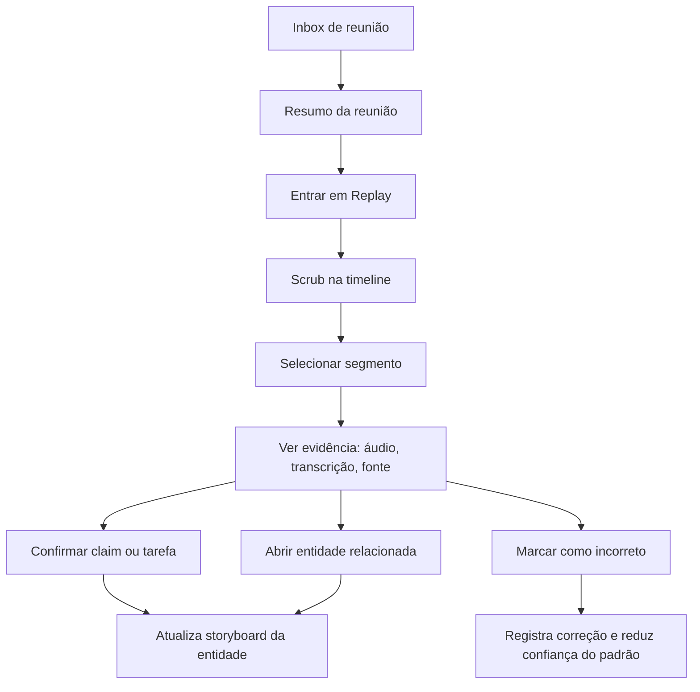
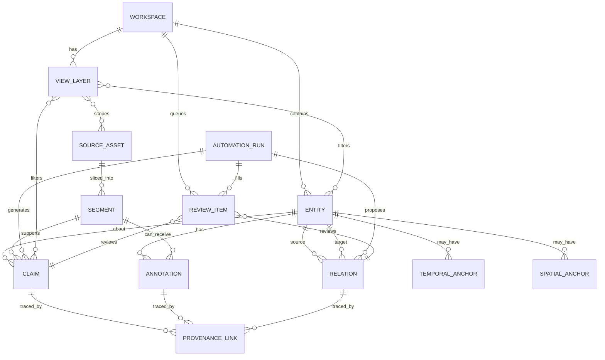
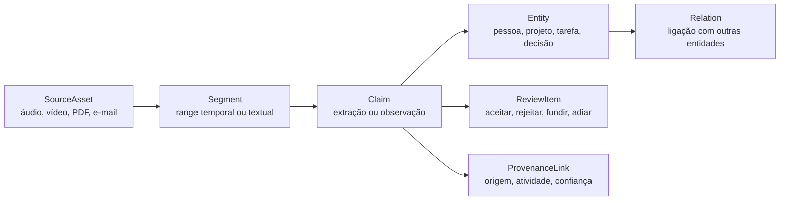

# Padrões de interface de mercados especializados para o Wawa-note

## Resumo executivo

A principal conclusão desta pesquisa é que o Wawa-note não precisa de “mais tipos de nota”; ele precisa de **mais projeções sobre o mesmo conjunto de dados**. Os aplicativos campeões estudados quase nunca tratam seus objetos como páginas isoladas. Em vez disso, eles mantêm um núcleo estável de objetos e relações — paciente, serviço, documento, ativo, elemento BIM, clip, entidade, notebook — e oferecem múltiplas vistas especializadas sobre esse núcleo: fila de triagem, storyboard contextual, mapa, grafo de dependência, timeline, inspetor de propriedades, busca estruturada, tabela relacionada e visão de evidência. Essa arquitetura aparece de formas diferentes em DataWalk, ArcGIS, Splunk, Datadog, Revit, Relativity, Final Cut Pro e JupyterLab. citeturn21view0turn25view2turn33view1turn26view0turn21view3turn33view7turn21view8turn21view5turn21view9

Para um workspace conversacional de memória pessoal + inteligência de reuniões, isso implica uma mudança estrutural: o núcleo de dados do Wawa-note deve passar a tratar **segmentos temporais, entidades, relações, claims, fontes e views** como objetos de primeira classe, com **proveniência explícita** e estado de revisão. A recomendação mais forte deste relatório é modelar o produto como um **grafo temporal com camadas de visualização**, não como um editor de documentos com features anexadas. Essa recomendação segue diretamente o que os mercados mais maduros fazem quando precisam lidar com escala, ambiguidade, rastreabilidade e colaboração. citeturn27view5turn21view0turn25view0turn21view8turn23view5turn33view1

Os padrões de maior valor para o iPhone não são os grandes canvases desktop, mas sim suas **compressões móveis corretas**: fila com priorização e “save-and-next”, storyboard persistente de contexto, timeline com replay, busca com escopo explícito, filtros salvos, cards de evidência com origem visível e modos offline/sync. ArcGIS Field Maps, Datadog Mobile, RelativityOne mobile e TradingView mostram que o celular funciona muito bem quando a tarefa é **triagem, captura, inspeção orientada por contexto e decisão rápida**, mas funciona mal quando tenta replicar, sem redução, toda a gramática do desktop. citeturn26view6turn26view7turn25view9turn35view0turn23view2turn23view3

A síntese para o Wawa-note é objetiva: o produto deveria evoluir em torno de seis primitives dominantes. **Fila**, para revisar e aceitar/rejeitar extrações; **entity storyboard**, para manter contexto persistente; **timeline/replay**, para voltar ao momento exato de uma fala/decisão; **layers/views**, para trocar semânticas de leitura sem duplicar dados; **property inspector**, para editar metadados e relações de qualquer objeto; e **evidence/provenance sheet**, para reduzir falsa certeza de IA. Esses padrões maximizam impacto e viabilidade móvel ao mesmo tempo. citeturn26view0turn31view1turn21view5turn25view4turn36view3turn27view5turn28view0

## Método e critérios

Escolhi um campeão por mercado com base em dois critérios: **força da metáfora de interface** e **documentação pública suficiente para análise rigorosa**. A lista final ficou assim: DataWalk, ArcGIS, Splunk Enterprise Security, Datadog, TradingView, Final Cut Pro, Revit, Epic Storyboard, RelativityOne Review Center e JupyterLab. Em alguns casos, o “campeão” é uma plataforma/ecossistema mais do que um binário isolado, porque é assim que o próprio mercado opera — por exemplo, ArcGIS no desktop/browser/mobile e Final Cut Pro entre Mac e iPad. citeturn21view0turn21view1turn21view2turn21view3turn21view4turn36view0turn33view7turn31view1turn21view8turn21view9

Há uma limitação importante no mercado de saúde. **Epic** é claramente um padrão dominante de interface longitudinal em prontuário, mas a documentação pública oficial de UI é muito mais fechada do que nos demais mercados. Por isso, a análise do Epic Storyboard foi feita com base em materiais públicos de treinamento de instituições que implantam Epic, complementados por literatura de segurança/usabilidade da AHRQ e, para o subdomínio de imagem, por materiais oficiais do ecossistema OsiriX. Onde essa triangulação foi necessária, eu sinalizo explicitamente no texto. citeturn31view1turn26view4turn22view0turn27view6turn26view5

A regra de interpretação adotada foi simples. Quando a documentação descreve um comportamento da interface, eu trato esse comportamento como fato; quando a documentação apenas sugere a organização do produto e a implicação para o Wawa-note depende de síntese, eu marco isso como **inferência de design**. Isso é especialmente importante em tópicos como IA, explicabilidade, segurança e confiança, onde NIST e W3C recomendam documentação explícita de riscos, proveniência e transparência. citeturn27view5turn28view0turn17search1

## Quadro comparativo

| Mercado | Campeão | Objeto primário | Metáfora dominante | Padrão que mais vale transportar para o Wawa-note | Trade-off principal | Fontes |
|---|---|---|---|---|---|---|
| Investigative intelligence | DataWalk | Entidade + relação | grafo investigativo e visual query | entity 360 + merge reversível + lineage visível | “hairball” visual e risco de entity resolution excessiva | citeturn21view0turn25view0turn25view2turn37view0 |
| GIS / geoespacial | ArcGIS | Feature/layer | layers + map + table + pop-up | layers salvas, spatial anchors, map↔table linked selection | oclusão, complexidade espacial e sincronização offline | citeturn21view1turn33view1turn33view2turn25view6turn33view3 |
| SIEM / SecOps | Splunk ES | Finding/notable/investigation | triage queue + workbench | fila priorizada + saved views + ações automatizadas com confirmação | fadiga de alertas e ruído operacional | citeturn21view2turn26view0turn26view1turn26view2 |
| Observability / APM | Datadog | Serviço/trace/incident | service map + service page | dependency map + filtros por tag + incident summary móvel | dependência de instrumentação e grafos ruidosos | citeturn21view3turn33view4turn25view9 |
| Trading / terminals | TradingView | Símbolo/gráfico/layout | chart-first workspace | replay temporal + watchlists + presets de layout | sobrecarga de indicadores e falsa confiança em overlays | citeturn21view4turn23view0turn23view1turn23view2 |
| Edição em timeline | Final Cut Pro | Clip range/projeto | magnetic timeline + index | transcript timeline com source ranges, roles e tags | complexidade de edição e alta densidade em telas pequenas | citeturn21view5turn23view4turn23view5turn36view0turn36view1 |
| CAD / BIM | Revit | Elemento/família/parâmetro | vistas sincronizadas + properties + schedules | property inspector + múltiplas projeções do mesmo objeto | sprawl de parâmetros e experiência desktop-first | citeturn33view7turn36view3turn23view7turn38view0turn38view1 |
| Saúde / EHR & imaging | Epic Storyboard | Paciente/chart | storyboard persistente + atividades | contexto persistente em toda a navegação + compare side-by-side | sobrecarga cognitiva, alert fatigue e informação fragmentada | citeturn31view1turn26view4turn22view0turn27view6turn18search1turn26view5 |
| Legal discovery | RelativityOne Review Center | Documento/email thread/queue | review queue + viewer + coding | save-and-next + coding states + painel persistente de thread/evidência | complexidade de busca e viés de priorização | citeturn21view8turn23view8turn34view1turn34view2turn35view0turn34view0 |
| Scientific workflows | JupyterLab | Notebook/cell/document | workspace dockado + command palette + sidebars | blocos executáveis, command palette, timeline de documento, deep links | estado oculto e reprodutibilidade frágil | citeturn21view9turn23view9turn27view0turn27view1turn27view3turn39view0turn27view4 |

A comparação acima sugere um denominador comum forte. Os apps campeões não escalam adicionando mais tela; eles escalam adicionando **mais modos de leitura do mesmo dado**, com filtros, triagem, persistência de contexto e transições reversíveis entre overview e detalhe. Esse padrão é particularmente consistente em ArcGIS, Splunk, Datadog, Revit, Relativity e JupyterLab. citeturn33view1turn26view0turn21view3turn33view7turn34view1turn39view0

## Estudos de caso

**DataWalk — investigação por entidades e relações.** O objeto central não é o “caso” textual, mas a **entidade conectada** dentro de um knowledge graph. O dado entra por ingestão multi-fonte, transformação, NLP e entity resolution; a análise acontece em visual queries, link charts, mapas e outras projeções salvas e compartilháveis. O diferencial não é só desenhar grafos, mas permitir perguntas multi-hop e consultas populacionais em escala, com 360° entity views, merge de objetos, alertas, undo/redo e colaboração seletiva com audit logs. Em IA, o produto já explicita integração de ML, NLP, inferência e LLMs, mas também destaca auditability, lineage e explainability — exatamente o antídoto para “certeza sem origem”. Para o Wawa-note, eu copiaria três coisas: **entity sheet 360**, **merge proposto com rollback** e **linha de proveniência sempre acessível desde qualquer insight**. A principal falha a evitar é o “grafo espaguete” e a fusão excessiva de entidades semelhantes. Visual/página oficial: Universe Viewer, investigation pages e material técnico do produto. citeturn21view0turn25view0turn25view1turn25view2turn25view3turn37view0

**ArcGIS — a camada é o contrato de leitura.** Em GIS, o objeto central é a **feature dentro de uma layer**, nunca um documento. A interface permite alternar entre mapa, cena 3D, tabela, related records, attachments e pop-ups, sempre preservando a identidade do feature. Filtros servem para “revelar o que importa”; tabelas existem como visão irmã do mapa; relações um-para-um ou um-para-muitos aparecem sem duplicação; e o móvel funciona porque o trabalho de campo é modelado como exploração, coleta, inspeção e sync offline. O que eu tomaria para o Wawa-note é a noção de **layers semânticas**: “pessoas”, “projetos”, “decisões”, “locais”, “tarefas”, “riscos”, cada uma alternável e filtrável sobre a mesma base. Em iPhone, isso vira um padrão poderoso: **filtro salvo + card geotemporal + attachments de evidência**. O risco a mitigar é poluição visual, baixa legibilidade cromática e inconsistência entre estado online/offline. Visual/página oficial: Scene Viewer, Map Viewer, ArcGIS Field Maps e App Store. citeturn21view1turn25view4turn25view5turn33view1turn33view2turn33view3turn26view6turn26view7

**Splunk Enterprise Security — a UI de segurança é uma UI de triagem.** O SIEM maduro organiza a experiência em torno de **findings/notables**, não em torno do log bruto. O Incident Review dashboard categoriza eventos por severidade e suporta triagem, atribuição e tracking; o Mission Control centraliza findings e investigations para triagem mais rápida; e o workbench estende a investigação com artifacts, painéis, tabs e perfis customizáveis. A gramática dominante é: listar, filtrar, salvar view, atribuir, suprimir, adicionar a investigação, rodar playbook. Para o Wawa-note, esse é o melhor modelo para uma **inbox de extrações e memórias sugeridas**: tudo o que veio de reunião, e-mail, upload ou IA deveria cair numa fila revisável antes de virar “verdade do workspace”. O grande risco, que o próprio mercado de SecOps já conhece, é alert fatigue: se tudo exige reação, nada parece importante. Visual/página oficial: Analyst queue, Incident Review e workbench com screenshot público na documentação. citeturn21view2turn26view0turn26view1turn26view2turn26view3

**Datadog — o mapa vale porque é acionável.** O objeto central é o **serviço observável**, com traces, logs, métricas, SLOs, deploys e incidentes correlacionados. O Service Map decompõe a aplicação em serviços e dependências observadas em tempo real, permite agrupar por time/aplicação, filtrar por facets/tags/status e isolar um serviço com upstream e downstream visíveis. No mobile, a experiência é recortada para on-call: incidents, dashboards, traces, logs, services e Bits AI SRE, com várias limitações explícitas para edição/configuração e widgets não suportados. Esse equilíbrio é muito instrutivo para o Wawa-note: o iPhone não precisa ser “o app inteiro”; ele precisa ser **a melhor interface para inspeção, triagem e resposta**. O padrão que mais vale importar é um **dependency map humano**: pessoas, reuniões, decisões e documentos como um service map cognitivo, com saúde/urgência e drilldown para evidência. O risco é sugerir causalidade demais a partir de correlação visual ou confiar demais em diagnósticos automáticos. Visual/página oficial: Service Map, Service Page e Datadog Mobile docs/App Store. citeturn21view3turn33view4turn33view5turn25view9turn13search3

**TradingView — ver bem antes de agir.** O objeto primário é o **gráfico do símbolo**, mas a interface só funciona porque ele é cercado por watchlists, layouts, search, screeners, indicators e replay. Supercharts coloca símbolo, intervalo, tipo de gráfico, indicadores e layouts no topo; watchlists acompanham o usuário em qualquer lugar do produto; symbol search é o ponto de entrada universal; e Bar Replay permite ensaiar leituras temporais sem risco real. Essa é provavelmente a referência mais subestimada para o Wawa-note: uma conversa, uma tarefa ou uma relação pessoal também podem ser lidas como **séries temporais com replay e overlays**. Eu adaptaria diretamente o padrão para um “conversation replay” em que o usuário volta ao momento exato de uma fala, vê quais entidades/tarefas surgiram ali e compara diferentes timeframes do mesmo relacionamento ou projeto. O risco a evitar é virar um app de overlays e indicadores, em que a densidade visual supera a capacidade de decisão. Visual/página oficial: Supercharts, watchlists, replay e app iOS. citeturn21view4turn23view0turn23view1turn23view2turn23view3

**Final Cut Pro — o tempo vira material manipulável.** O objeto central é o **clip range ancorado em uma timeline**, não o arquivo bruto nem a pasta. O Magnetic Timeline substitui faixas rígidas por uma estrutura trackless com primary storyline e connected clips; keywords geram Keyword Collections automaticamente; Smart Collections e Timeline Index transformam metadados em novas vistas sem mover mídia; e a busca alcança clip name, role, keyword, marker, custom metadata, camera e até detecções automáticas. Para o Wawa-note, սա é ouro puro: transcrições, áudios e vídeos de reuniões deveriam ser manipulados como **ranges anotáveis**, com roles, tags e vistas inteligentes, e nunca como blocos indivisíveis de texto. O padrão mais valioso aqui é **timeline index + persistent tags + exact source range**. O que deve ficar fora do iPhone é a edição estrutural pesada; o que deve entrar é scrubbing, replay, highlights e revisão contextual rápida. Visual/página oficial: Magnetic Timeline, keyword collections, timeline index e páginas do produto/iPad. citeturn21view5turn23view4turn23view5turn36view0turn36view1turn36view2

**Revit — um objeto, muitas projeções.** O campeão do BIM ensina que o objeto real é o **elemento parametrizado**, e que listas, vistas, tags, schedules e canvases são apenas projeções desse mesmo núcleo. O Project Browser organiza vistas, schedules e sheets em hierarquia lógica; o drawing area mostra a vista corrente; a Properties Palette é modeless e altera parâmetros do elemento selecionado; e os schedules listam qualquer tipo de elemento do modelo e podem ser refinados, duplicados ou reutilizados. Essa separação entre **modelo** e **projeções** é extremamente relevante para o Wawa-note. Uma pessoa, um projeto ou uma decisão deveria existir uma única vez, mas poder aparecer como card, item de lista, nó de grafo, evento de timeline, linha de tabela e resultado de busca sem ser duplicado. Em iPhone, o padrão mais transportável é o **property inspector em bottom sheet**: tocar um objeto em qualquer vista e editar seus campos, aliases, relações e status no mesmo lugar. O risco é sprawl de parâmetros e excesso de densidade sem hierarquia. Visual/página oficial: Quick Start Guide, User Interface, schedules e viewers/BIM 360 como experiência móvel complementar. citeturn33view7turn36view3turn23view7turn24search2turn38view0turn38view1

**Epic Storyboard — contexto persistente enquanto a navegação muda.** Mesmo com documentação pública limitada, o padrão de interface é claro: o **Storyboard** mantém um resumo essencial do “paciente” visível, com acesso rápido a dados-chave, enquanto o restante da navegação troca de atividade. Materiais públicos de implantação descrevem o Storyboard como uma interface comum a Hyperspace, mobile e portal, sempre presente como coluna à esquerda, mostrando demografia, alergias, problemas, medicações e outros elementos-chave em forma resumida; tip sheets mostram explicitamente essa coluna lateral persistente. A literatura da AHRQ ajuda a entender por que isso importa: usabilidade pobre, overload e alert fatigue podem degradar segurança e aumentar carga cognitiva. Para imagem clínica, o ecossistema OsiriX reforça padrões paralelos de comparação de estudos, overlays, annotations, cross-reference lines, split screen e hanging protocols. Para o Wawa-note, սա gera uma recomendação de alto impacto: todo detail view deveria poder exibir um **storyboard persistente do objeto atual** — pessoa, projeto, reunião, cliente, tema — sem perder o fluxo principal. O risco é o storyboard virar um “painel de tudo”, inchado e pouco legível. Visual/página/ilustração pública: glossário público do Storyboard, tip sheets com screenshots e KB pública do OsiriX. citeturn31view1turn26view4turn22view0turn32view0turn27view6turn18search1turn26view5

**RelativityOne Review Center — revisão em escala exige semântica de decisão.** O objeto central é o **documento a ser revisado dentro de uma queue**, mas a interface floresce porque isso está ligado a saved searches, AI prioritization, dashboard, email thread visualization, dtSearch e modelos reaproveitáveis. Review Center permite criar queues a partir de saved searches, servir documentos por ordem definida por IA ou sort customizado, revisar com Start Review → coding → Save and Next, acompanhar progresso via dashboard temporal e reaproveitar “saved models” sem expor os documentos originais. O viewer de email thread é um caso exemplar: ele persiste aberto enquanto o usuário navega, mostra a thread da esquerda para a direita, permite zoom, tooltip, mass edit por ramo e coding highlight em tempo real. Para o Wawa-note, quase tudo aqui é útil: **queue de revisão**, **decisões de codificação explícitas** como aceitar/rejeitar/mesclar/adiar/disputar, **save-and-next**, **highlight de divergência** e **painel persistente de thread/evidência**. A principal falha a evitar é transformar busca e priorização em caixa-preta excessiva. Visual/página oficial: Review Center, review queue cards, email thread visualization, dtSearch e experiência móvel unificada. citeturn21view8turn23view8turn34view1turn34view2turn34view0turn35view0

**JupyterLab — bloco, workspace e comando.** O objeto central é o **notebook/cell/document**, mas a interface funciona como um workspace dockado com sidebar, command palette, debugger, file browser, table of contents, multiple viewers e colaboração em tempo real. O notebook combina código executável, markdown, equações, imagens, visualizações e output; a file browser administra arquivos e compartilhamento de links; a command palette transforma qualquer ação em comando procurável; o debugger expõe variables, breakpoints e call stack; a ToC mapeia headings para navegação; e a linha do tempo experimental de documento introduz um slider para version history, comparação e restore. O lado negativo aparece claramente na literatura de reprodutibilidade: notebooks melhoram a documentação, mas não garantem execução ou repetibilidade por si só. Para o Wawa-note, eu não copiaria o “código” em si; eu copiaria a **gramática de blocos**, a **command palette**, os **deep links compartilháveis** e o **document timeline slider**. Esses padrões combinam muito bem com um app conversacional onde cada bloco pode ser fala, resumo, claim, entidade, tarefa ou evidência. Visual/página oficial: interface do JupyterLab, notebooks, RTC, ToC, debugger e blog do document timeline. citeturn21view9turn23view9turn27view0turn27view1turn27view2turn27view3turn39view0turn39view1turn27view4

## Padrões prioritários para o Wawa-note

A lista abaixo está ordenada por **impacto provável no produto** e **viabilidade no iPhone**. O critério não foi “o mais sofisticado”, e sim “o que mais muda o valor percebido do Wawa-note sem importar complexidade desktop desnecessária”.

| Prioridade | Padrão | Impacto | Viabilidade móvel | Por que vale implementar | Inspirações |
|---|---|---:|---:|---|---|
| 1 | Storyboard persistente de entidade | Muito alto | Alto | Mantém contexto contínuo enquanto o usuário troca de tela, reduzindo reabertura mental do caso, pessoa ou projeto. | citeturn31view1turn26view4turn21view0 |
| 2 | Fila de triagem com estados explícitos | Muito alto | Alto | Converte extrações de IA/importações em revisão humana clara: aceitar, rejeitar, fundir, adiar, disputar, escalar. | citeturn26view0turn21view8turn23view8 |
| 3 | Evidence sheet com proveniência visível | Muito alto | Alto | Reduz falsa certeza mostrando origem, trecho, arquivo, tempo, autor, confiança e atividade geradora. | citeturn27view5turn37view0turn34view1 |
| 4 | Timeline com replay e source ranges | Muito alto | Médio-alto | Permite voltar ao momento exato da fala/decisão, em vez de depender de resumo textual achatado. | citeturn21view5turn23view1turn27view3 |
| 5 | Layers e views salvas | Alto | Alto | A mesma base de dados pode ser lida como pessoas, tarefas, decisões, lugares ou riscos, sem duplicação. | citeturn25view4turn33view1turn26view1 |
| 6 | Busca com escopo explícito e command palette | Alto | Alto | Procura rápida, acionável e memorável: buscar “em pessoas”, “em claims”, “em fontes”, “neste projeto”, “nesta reunião”. | citeturn39view0turn25view5turn34view2turn21view4 |
| 7 | Property inspector universal | Alto | Médio-alto | Tocar um objeto em qualquer vista e editar seus metadados/relacionamentos no mesmo componente. | citeturn36view3turn33view7turn27view2 |
| 8 | Mapa de dependências entre objetos | Médio-alto | Médio | Excelente para entender propagação de impacto entre pessoas, reuniões, tarefas e projetos. | citeturn21view3turn33view4turn21view0 |
| 9 | Vistas de comparação lado a lado | Médio-alto | Médio | Muito útil para “antes vs depois”, reunião A vs reunião B, versão atual vs histórica, documento vs resumo. | citeturn26view5turn33view1turn31view2 |
| 10 | Offline-first para captura/inspeção | Médio | Alto | Importante para uso pessoal em deslocamento, visitas, viagens e revisão rápida sem rede. | citeturn25view6turn35view0turn26view6 |

A hierarquia acima também sugere o que **não** priorizar primeiro. Grandes canvases de grafo livres, edição estrutural pesada de timeline, painéis com dezenas de colunas e configurações profundas de automação têm valor, mas entregam mais no iPad/Mac do que no iPhone. No telefone, o melhor produto é o que privilegia contexto, revisão e recall, não autoria massiva. citeturn25view9turn26view7turn35view0turn36view1

## Experimentos de interface no iPhone

**Experimento de triagem com evidência verificável.** A proposta é uma tela principal chamada **Inbox**, composta por cards de “itens a revisar”: entidades extraídas de reunião, tarefas detectadas, claims, merges sugeridos, anexos recém-importados e memórias resurfaced. Cada card teria prioridade, origem e tipo; ao tocar, abriria uma **Evidence Sheet** com trecho exato, tempo no áudio, fonte original, confiança da IA e ações de decisão. A interação base seria **Save & Next**, inspirada em Relativity e em filas de triagem do Splunk. Métricas principais: tempo médio para revisar 20 itens, taxa de correção de extrações erradas, proporção de itens aceitos sem abrir evidência, proporção de itens com merge revertido e confiança subjetiva do usuário após revisão. citeturn23view8turn26view0turn34view1turn27view5

**Experimento de storyboard contextual para pessoas e projetos.** A proposta é uma navegação detalhada em que qualquer tela de pessoa, projeto, reunião ou documento tem uma **Context Bar** persistente no topo, comprimida em iPhone como um chip expansível com resumo de estado: quem é, última interação, decisões abertas, tarefas vinculadas, risco, próximos marcos e fontes recentes. Um swipe para baixo abriria a vista expandida do storyboard; um swipe lateral alternaria entre “Resumo”, “Relações”, “Linha do tempo” e “Fontes”. Métricas: tempo para responder perguntas como “o que já decidimos com este cliente?” ou “qual foi a última vez que falei com essa pessoa?”, taxa de navegação de retorno, número de telas visitadas por tarefa e recordação correta de contexto. citeturn31view1turn26view4turn21view0turn26view5

**Experimento de replay conversacional temporal.** A proposta é uma tela **Replay** para reuniões e conversas. Ela exibiria uma filmstrip/timeline com segmentos, waveform simplificada, capítulos detectados, tags, entidades citadas e ações sugeridas. O usuário poderia scrubbar no tempo, reproduzir do ponto exato, tocar uma entidade para ver onde ela aparece de novo e sobrepor camadas como “decisões”, “objeções”, “promessas” ou “follow-ups”. Métricas: tempo para localizar o momento de uma decisão, taxa de acerto na identificação do autor de uma promessa, uso de replay versus uso de busca convencional e taxa de compartilhamento de trechos específicos. citeturn21view5turn23view1turn27view3turn23view5

O fluxo do experimento de replay pode ser desenhado assim:

## Modelo de dados e governança

A mudança de interface recomendada exige uma mudança equivalente no modelo de dados. O Wawa-note deveria adotar um núcleo com **entidades, relações, segmentos, fontes, claims, views, filas de revisão e eventos de automação**, mantendo a proveniência como estrutura transversal. W3C PROV formaliza a ideia de que proveniência é informação sobre **entities, activities e people**; os mercados analisados mostram que, na prática, isso precisa virar produto, não só backend. DataWalk eleva lineage a capability explícita; Relativity, Splunk e Final Cut mostram a importância de ranges, estados de revisão, cadeias de origem e reversibilidade; ArcGIS e Revit mostram que o mesmo objeto precisa suportar múltiplas projeções sem cópia. citeturn27view5turn37view0turn34view1turn26view0turn21view5turn33view1turn33view7

A recomendação de modelo é esta:

| Objeto | Função no Wawa-note | Implicação de UI |
|---|---|---|
| `Entity` | pessoa, organização, projeto, lugar, tarefa, decisão, tema, documento, reunião | toda tela pode ancorar num storyboard |
| `Relation` | ligação tipada entre entidades | grafo, service map, related records |
| `SourceAsset` | áudio, vídeo, PDF, e-mail, página, imagem, arquivo | evidence sheet e viewer |
| `Segment` | range temporal/textual dentro de uma fonte | replay, citações exatas, highlights |
| `Claim` | afirmação extraída ou anotada | revisão humana, confiança, disputa |
| `Annotation` | nota do usuário, marcação, correção | feedback explícito e aprendizado |
| `ViewLayer` | filtros, scopes, ordenações e encodings salvos | layers semânticas e presets |
| `ReviewItem` | unidade de triagem na inbox | save-and-next, status, prioridade |
| `AutomationRun` | execução de IA/regra/importação | rastrear como algo foi gerado |
| `ProvenanceLink` | ponte entre objeto e sua origem/atividade | auditoria, confiança, rollback |
| `TemporalAnchor` | intervalo no tempo, timezone, granularidade | timeline e comparações |
| `SpatialAnchor` | coordenadas, bbox, local inferido/confirmado | mapas e contexto espacial |

O ER simplificado fica assim:

O fluxo “fonte → timeline → entidade” também precisa ser explícito no produto:

Em governança e risco, quatro cuidados devem ser tratados como requisitos, não como polimento tardio. **Privacidade**: para um app iOS-first que lida com memória pessoal e reuniões, o ideal é privilegiar processamento on-device ou arquiteturas em que o usuário entenda claramente quando algo sai do dispositivo; a própria Apple descreve processamento on-device como base de privacidade e alerta que promessas de privacidade em serviços cloud de IA são difíceis de verificar. **Falsa certeza de IA**: NIST enfatiza trustworthiness, transparência e riscos de sistemas opacos, e isso exige UI que mostre evidência e não só resposta. **Sobrecarga visual/cognitiva**: a literatura de EHR liga má usabilidade e overload a risco real; por isso, disclosure progressivo, filtros e resumos focados devem substituir dashboards “de tudo”. **Acessibilidade**: Apple recomenda contraste adequado, diferenciação além de cor e suporte acessível a charts, inclusive com áudio graphs para pessoas com baixa visão ou cegueira. citeturn27view7turn28view0turn17search1turn27view6turn18search1turn40view4turn40view5

A consequência prática para o Wawa-note é esta: toda automação deve gerar um `AutomationRun`; todo insight importante deve apontar para `ProvenanceLink`; toda UI densa deve ter modo resumido; e todo elemento visual usado para estado ou categoria deve continuar compreensível sem depender só de cor. Em iPhone, isso significa bottom sheets, disclosure control, filtros persistentes, ícones consistentes e views com poucos objetivos por tela. citeturn27view5turn28view0turn40view4turn40view5

## Leituras recomendadas

As leituras abaixo estão priorizadas para uma equipe de produto/design que queira transformar este relatório em sistema.

**Ler primeiro, em ordem prática de impacto.**

1. **DataWalk — Universe Viewer, investigação e Composite AI.** Excelente para entender entity-centric UI, visual query, lineage e explainability. citeturn21view0turn25view0turn37view0  
2. **ArcGIS — Scene Viewer, Map Viewer tables/related records e Field Maps.** Base para layers, map↔table e offline móvel. citeturn21view1turn33view1turn33view3turn25view6  
3. **Splunk ES — Incident Review, Analyst Queue, Investigation Workbench.** O melhor pacote para desenhar triagem, saved views e workbench de investigação. citeturn21view2turn26view0turn26view1turn26view2  
4. **Datadog — Service Map, Service Page e Mobile docs.** Muito útil para dependency maps e compressão mobile do desktop. citeturn21view3turn33view4turn25view9  
5. **TradingView — Supercharts, watchlists e Bar Replay.** Referência direta para replay temporal e presets de leitura. citeturn21view4turn23view0turn23view1  
6. **Final Cut Pro — Magnetic Timeline, keyword collections e timeline index.** Melhor fonte para source ranges, timeline semântica e busca por metadados. citeturn21view5turn23view4turn23view5  
7. **Revit — User Interface, Properties Palette e Schedules.** Essencial para pensar “um objeto, várias projeções”. citeturn33view7turn36view3turn23view7  
8. **Epic Storyboard public tip sheets + AHRQ EHR usability.** Fundamental para entender contexto persistente e riscos de overload/alert fatigue. citeturn31view1turn26view4turn22view0turn27view6turn18search1  
9. **RelativityOne — Review Center, email thread visualization, dtSearch, mobile.** Melhor referência para revisão assistida por IA com rastreabilidade. citeturn21view8turn34view1turn34view2turn35view0  
10. **JupyterLab — interface, notebooks, command palette, RTC, timeline de documento.** Base para blocos, comando, ambiente dockado e histórico navegável. citeturn21view9turn39view0turn27view0turn27view3  

**Ler em seguida, para fundamento de arquitetura e governança.**

- **W3C PROV-Overview.** É a melhor base conceitual para modelar proveniência como produto, não só auditoria. citeturn27view5  
- **NIST AI Risk Management Framework.** Serve para transformar “IA útil” em “IA verificável e governável”, especialmente em confiança, transparência e risco operacional. citeturn28view0turn17search1  
- **AHRQ — Improving Electronic Health Record Usability for Patient Safety.** Ajuda a evitar que o Wawa-note escorregue para overload, alert fatigue e UI que aumenta carga cognitiva. citeturn27view6turn18search1  
- **Samuel et al., 2024, GigaScience — reproducibility of Jupyter notebooks.** Importante para lembrar que blocos ricos e históricos são valiosos, mas não garantem consistência sozinhos. citeturn27view4  
- **Apple — Private Cloud Compute, foundation models e chart accessibility.** Essenciais para decisões sobre privacidade, compressão mobile, ícones e acessibilidade de dados no ecossistema iOS. citeturn27view7turn27view8turn40view4turn40view5

A principal limitação aberta deste relatório é a disponibilidade pública desigual de documentação visual do Epic e de detalhes móveis do ecossistema DataWalk/Revit. Onde a evidência pública foi menos direta, eu priorizei transparência e triangulação em vez de forçar conclusões. Ainda assim, o quadro geral é estável: **o futuro mais promissor para o Wawa-note é um workspace conversacional centrado em entidades, ranges temporais e proveniência, com views especializadas de triagem, storyboard, timeline, layers e evidência**. citeturn31view1turn26view4turn27view6turn21view0turn33view7