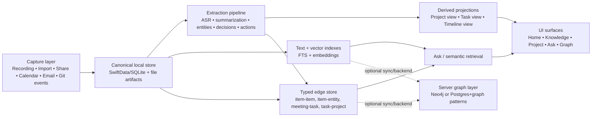
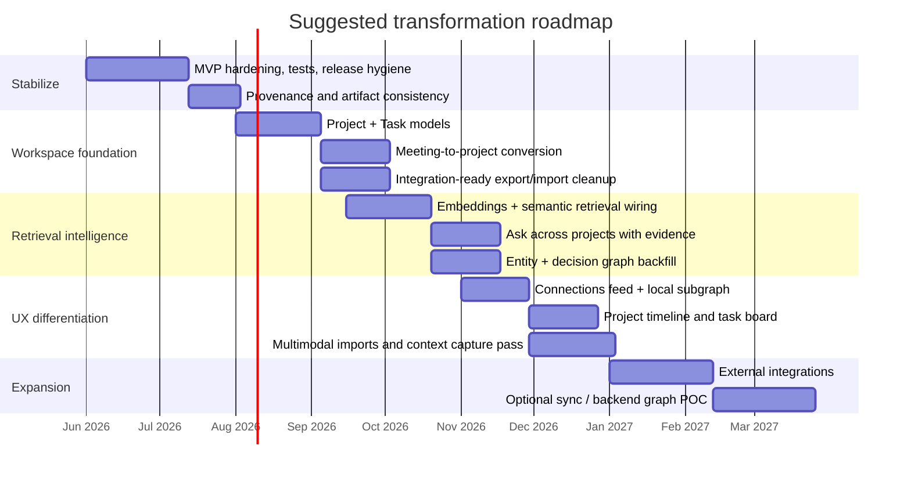

# Transforming Wawa Note into an AI Project Workspace with Graph Intelligence

## Executive summary

The public repository describes **wawa-note** as an iPhone-native, provider-agnostic AI meeting companion whose current verified scope is still the MVP loop of **record → transcribe → analyze → save → review → export**. Public project status says Phases 0–7 are implemented, but Phase 8 hardening is still outstanding; the repo also explicitly notes **no unit tests yet**, **streaming not implemented**, and **import audio button is TODO**. The architecture and spec already point beyond a recorder toward “future project memory,” project grouping, provider abstraction, structured analysis, local-first data handling, and traceable AI outputs. citeturn2view1turn0view2turn4view0turn3view1turn3view2

The provided ZIP snapshot shows a product that is **already being transformed in code**, beyond what the public `main` branch documents. In the local snapshot, there are new workspace-oriented primitives such as `KnowledgeItem`, `Folder`, `Annotation`, context sensors, template-driven AI interactions, semantic-search scaffolding, import/export extensibility, and a new Home / Knowledge / Ask navigation model. In other words, this is no longer just a meeting recorder conceptually; it is already becoming a local-first knowledge workspace in implementation, but the transformation is **partial, uneven, and not yet coherently finished**.

My main conclusion is this: **do not turn Wawa Note into “Obsidian + Notion + Otter + Neo4j” all at once.** The strongest path is to productize a narrower, differentiated core: **meeting-centric knowledge capture that can become project memory**, with graph features as a **derived capability**, not the primary editing model. That means: keep capture and evidence provenance rock solid, introduce explicit Project and Task models, wire cross-item retrieval properly, and only then add graph visualization and deeper GraphRAG capabilities. The competitive market strongly suggests that winners are either excellent at **PKM/workspace structure** or excellent at **meeting outputs/actionability**; few products truly combine both well. Obsidian emphasizes local Markdown, graph view, and Canvas; Logseq emphasizes local-first graph workflows; Notion wins on integrating docs, projects, connections, and AI meeting notes; meeting copilots such as Granola, Otter, and Fireflies win on summaries, action items, and post-meeting workflows; Neo4j demonstrates why graph + vector retrieval becomes valuable once you need explainable, multi-hop reasoning. citeturn14search7turn7search0turn6search9turn12search2turn9search8turn6search12turn9search0turn9search6turn9search1turn13search14turn13search1

The highest-confidence strategic recommendation is to build the next product around four layers: **capture**, **canonical knowledge store**, **derived task/project graph**, and **retrieval/assistant layer**. On that basis, the best low-effort/high-impact wins are to fix evidence fidelity, add first-class Projects and Tasks, wire the Ask experience to real semantic retrieval, and add “meeting-to-project conversion.” The ambitious features worth pursuing afterward are GraphRAG across projects, multimodal ingestion, privacy-preserving edge inference, and optional collaboration/sync. If well executed, Wawa Note can occupy a real gap between note tools and meeting bots: a **local-first AI operating layer for project memory**. citeturn0view2turn3view1turn3view2turn13search14turn13search17

## Current state and gap analysis

Public documentation paints a relatively clear baseline. The product vision is an iPhone AI meeting companion and universal AI client with provider abstraction, local storage, structured meeting analysis, and eventual project-based meeting memory. The implementation plan prioritizes a thin-slice MVP, and current project status says the MVP code exists and builds, but still lacks real-device validation and hardening. The same public docs show that the intended structure already includes project association, action-item extraction with provenance, privacy modes, failure recovery, import/export, and a path toward project memory. citeturn0view2turn3view0turn2view1turn3view1turn3view2turn3view3

The local ZIP snapshot is materially ahead of the public repo. It contains an untracked `docs/TRANSFORMATION_PLAN.md`, many new untracked source files, and major UI and model changes that are not reflected in the public repo’s six-commit, no-release state. That divergence matters operationally: your current “truth” is split between **public docs describing a meeting MVP** and **local code exploring a knowledge-workspace pivot**. That is manageable, but it means the most urgent problem is not lack of ideas; it is **product coherence, branch hygiene, and migration discipline**.

| Capability area | Planned in public docs | Public repo status | Local snapshot status | Assessment |
|---|---|---|---|---|
| Meeting capture / transcription / analysis / export | Explicit MVP target and phases 0–7; structured analysis and Markdown/JSON export are core requirements. citeturn2view1turn3view0turn4view4turn3view1 | Implemented in docs, but not yet device-validated; no unit tests; streaming not implemented. citeturn2view1 | Still present and forms the foundation. | **Keep as the stable core.** |
| Provider abstraction / BYOK / local-first privacy | Central in spec, architecture, contracts, and security docs. citeturn0view2turn4view0turn3view2turn3view3 | Strongly aligned. | Expanded with more provider config/template ideas. | **A genuine strength; preserve.** |
| Chat / general AI client | Publicly planned as Phase 7. citeturn4view4 | Public docs say implemented at MVP level. citeturn2view1 | In the local snapshot, chat is no longer a primary navigation focus. | **De-emphasize unless it serves workspace memory.** |
| Project-based memory | Explicitly envisioned in spec through project grouping and cross-meeting queries. citeturn4view2 | Not a first-class public data model yet. citeturn3view1 | Replaced partly by folders / knowledge items, but no true Project graph. | **Biggest structural gap.** |
| Knowledge workspace / non-meeting content | Not part of original MVP; mostly post-MVP direction. citeturn4view4 | Public docs remain meeting-first. | `KnowledgeItem`, `Folder`, `Annotation`, templates, non-meeting item types exist in the local snapshot. | **Promising, but unfinished and ahead of docs.** |
| Cross-item retrieval / Ask across workspace | Public spec wants questions about meetings and eventual project memory. citeturn4view2 | Not clearly described in public MVP docs. | Local Ask UI exists, but current implementation is not yet a robust evidence-first retrieval layer. | **A clear quick win if wired properly.** |
| Graph visualization | Not in public MVP. | Not present publicly. | Local snapshot has connection models/feed concepts, but no real graph view shipped. | **Still aspiration, not product.** |
| Import / multimodal input | Original spec includes audio import and later OCR attachments. citeturn4view3turn4view4 | Public status still says import audio button is TODO. citeturn2view1 | Local snapshot includes audio import service and format importers for JSON/Markdown/ICS/SRT. | **Good trajectory; needs consolidation.** |
| Collaboration / sync | Not in MVP baseline; backend explicitly deferred. citeturn2view1turn3view2 | Not implemented. | Still absent in any robust sense. | **Do not front-load.** |
| Hardening / QA / releases / governance | Public docs call for device testing and hardening. citeturn2view1turn4view4 | Public repo has six commits, no releases, and GitHub shows no visible license file in the top-level listing. citeturn5view1turn5view0 | Local snapshot is ahead but uncommitted. | **This is a material risk.** |

The most important code-level insight from the local audit is that several “transformation” features exist mostly as **scaffolds** rather than fully-integrated product capabilities. In particular, the workspace model is ahead of the public docs, but there is still no first-class **Project**, **Task**, **Person**, or **Decision graph**. The snapshot adds folders, annotations, templates, embeddings, semantic search services, and context capture, but the product still behaves more like a meeting app with adjacent PKM features than like a coherent project-oriented workspace.

The highest-leverage quick wins are the ones that finish what is already half-built:

| Quick win | Why it matters | Effort | Impact |
|---|---|---:|---:|
| Make **Project** and **Task** first-class models instead of inferring project structure from folders | This closes the gap between “meeting app” and “project memory system.” | Low–medium | Very high |
| Fix **meeting / item / analysis provenance** end-to-end, including edge evidence and stable IDs | Your public docs already emphasize traceability; this is essential for trust and future graph features. citeturn0view2turn3view1 | Low | Very high |
| Wire **Ask** to real semantic retrieval over transcript/analysis/entities, not lightweight title-based context | This is the fastest way to make the app feel genuinely intelligent. | Medium | Very high |
| Add a **meeting-to-project conversion wizard** | A distinctive workflow no mainstream note or meeting tool handles especially well. | Medium | Very high |
| Add **task exports/integrations** for action items | Action is where meeting value compounds; Otter, Fireflies, and Notion all emphasize action items. citeturn9search6turn9search1turn6search12 | Low–medium | High |
| Ship a **connections feed / local subgraph** before a global canvas graph | This delivers graph value without a hairball. Kumu and Neo4j Bloom both point toward guided, explorable relationship views over raw node soup. citeturn7search3turn7search7turn13search1turn13search16 | Medium | High |
| Finish **device validation, tests, and release hygiene** | Without this, every ambitious feature compounds fragility. citeturn2view1turn4view4 | Low–medium | High |

The ambitious features worth building later are also clear: GraphRAG over project memory, multimodal capture from images/web/PDF/email, on-device embeddings/NER/summarization where feasible, real-time collaboration/sync, and privacy-preserving edge inference. Those belong **after** the canonical knowledge and project graph are reliable. Neo4j’s current GraphRAG guidance is directionally useful here: vectors are excellent for similarity, but graphs become especially valuable when you want multi-hop, explainable, structured retrieval. citeturn13search14turn13search17turn13search6

## Competitive landscape

The market splits into four relevant patterns. Obsidian and Logseq show how powerful **local-first knowledge work** can be; Roam shows the enduring power of **block references and linked thought**; Notion shows the value of unifying **docs + projects + AI meeting capture + app connections**; and dedicated meeting copilots such as Granola, Otter, and Fireflies show that users care most about **usable outcomes after the meeting**. Kumu and Neo4j are especially instructive for graph UX and graph backends: graph systems are strongest when they reveal structure progressively and support both exploration and explanation. citeturn14search7turn7search0turn6search9turn12search2turn10search0turn9search8turn6search12turn9search0turn9search6turn9search1turn7search3turn13search1turn13search14

| Product / class | What it does especially well | Pattern worth borrowing | Pattern to avoid | Official evidence |
|---|---|---|---|---|
| **Obsidian** | Local Markdown vaults, graph view, Canvas, links, flexible project/knowledge organization | Keep files user-owned; treat graph and canvas as **views**, not the only model | Do not assume a pretty graph equals project intelligence | Obsidian stores notes as local Markdown files; has Graph view; Canvas supports notes, images, PDFs, audio, video, and web pages. citeturn14search7turn7search0turn6search9turn14search3 |
| **Roam Research** | Networked thought, backlinks, block-centric linking | Strong block references and daily-note capture for meeting fragments | Weak deliverables/integrations if copied too literally | Roam positions itself as note-taking for networked thought and “as powerful … as a graph database.” citeturn10search0 |
| **Logseq** | Open-source, privacy-first, graph/outliner workflows, plugins, multiple file formats | Open toolbox mentality; block/task workflows; plugin ecosystem | Don’t over-complexify the UX before core flows are stable | Logseq describes itself as privacy-first / open-source, and its docs center on graphs and graph creation. citeturn6search3turn10search17turn12search2 |
| **Notion** | Docs + projects + calendar/mail/connections + AI meeting notes | Make meetings flow directly into project structures and connected apps | Avoid cloud-first lock-in as the default for sensitive meetings | Notion markets AI Meeting Notes, Projects, Knowledge Base, Calendar, Mail, and Connections as part of one workspace. citeturn9search8turn6search12turn6search1 |
| **Mem** | AI organization, related notes, smart search, voice/meeting capture | Automatic relatedness and “thought partner” positioning | Avoid opaque organization that users cannot audit | Mem emphasizes AI-assisted organization, meeting notes, related notes, and smart search. citeturn9search2turn10search5turn10search14 |
| **Joplin** | Offline-first notes, encryption, plugins, OCR, practical import/export | Strong local ownership, exportability, plugin-friendly pragmatism | No native graph means weaker relationship-centric UX | Joplin emphasizes open format ownership, E2EE, plugins, offline-first OCR, and import/export formats such as JEX/raw. citeturn8search4turn8search8turn8search10turn8search16 |
| **Athens** | Collaborative knowledge graph concept | Keep collaborative graph aspirations in the long view | Stability risk: interesting concept, weak current viability | Athens’ GitHub says it is no longer maintained, even though it was built as a graph-based knowledge system. citeturn12search1turn12search7 |
| **Kumu** | Narrative systems mapping and relationship-first exploration | Progressive relationship views, map narratives, non-hairball graph UX | Don’t turn the core product into a consultancy-style mapping tool | Kumu emphasizes systems maps, social network maps, and rich information on elements and connections. citeturn7search3turn7search7 |
| **Neo4j stack** | Serious graph backend, vector index, GraphRAG, Bloom visualization | Use graph + vector together when explainability and multi-hop logic matter | Don’t adopt backend graph complexity too early on-device | Neo4j now explicitly promotes GraphRAG, vector search, and Bloom for queryable graph visualization. citeturn13search14turn13search17turn13search1turn13search16 |
| **Granola / Otter / Fireflies** | Fast post-meeting value: transcripts, summaries, action items, searchable workspace | Prioritize outputs that users can act on in minutes | Avoid becoming “just another meeting bot” with weak project memory | Granola positions itself as an AI notepad for meetings; Otter emphasizes summaries, decisions, assigned action items, and live transcription; Fireflies emphasizes notes, transcribe, summarize, search, and action items. citeturn9search0turn9search6turn9search10turn9search1turn9search4 |

The strategic implication is straightforward. **Borrow Obsidian/Logseq for data ownership and graph thinking, borrow Notion for project integration, borrow Otter/Fireflies/Granola for meeting post-processing, and borrow Kumu/Neo4j for graph exploration patterns.** But do not copy any one product wholesale. Your chance to differentiate is narrower and stronger: **meeting evidence becomes reusable project memory, and project memory becomes an explorable graph with tasks, decisions, owners, and connected artifacts**. citeturn14search7turn12search2turn9search8turn9search6turn7search7turn13search14

## Target architecture and product design

The target product should be framed as a **local-first AI workspace for project memory**. Meetings are the highest-signal input, but not the only one. The app should treat recordings, transcripts, notes, imported files, bookmarks, images, emails, code artifacts, and task updates as **evidence-bearing knowledge items** that can be organized into projects and connected through typed relationships.



The right graph architecture is **layered**, not monolithic. On-device, use the local canonical store as truth, not a separate graph database. Represent the graph with typed entities and edge tables in SwiftData/SQLite, plus file artifacts for large blobs. Build **derived** indexes for FTS and embeddings. Only add a remote graph backend when you need multi-user sync, heavy GraphRAG, or cross-device team analytics. This approach is much more compatible with the repo’s current local-first architecture and privacy model than trying to force Neo4j into the mobile runtime from day one. The public docs already favor modular boundaries, local-first storage, and provider abstraction, and Neo4j’s modern GraphRAG story supports using graph + vector together only where multi-hop reasoning and explainability justify the complexity. citeturn4view0turn3view1turn3view2turn13search14turn13search17

I would model **three explicit graphs**:

First, a **knowledge graph** for semantic relationships: `Item -> mentions -> Entity`, `Item -> relates_to -> Item`, `Decision -> supported_by -> TranscriptSegment`, `Note -> references -> Meeting`, `Bookmark -> evidence_for -> Project`.

Second, a **temporal/event graph**: `CalendarEvent -> triggered -> Meeting`, `Meeting -> produced -> Decision`, `Decision -> preceded -> Task`, `Task -> updated_at -> Event`, `Artifact -> version_of -> Artifact`.

Third, a **task/project graph**: `Project -> contains -> Meeting`, `Project -> contains -> Note`, `Project -> owns -> Task`, `Task -> assigned_to -> Person`, `Task -> blocked_by -> Task`, `PR/Commit/CI job -> affects -> Task/Project`.

A compact proposed relational schema for the on-device canonical layer looks like this:

```sql
CREATE TABLE workspace_item (
  id TEXT PRIMARY KEY,
  type TEXT NOT NULL,              -- meeting, note, bookmark, image, email, commit, doc
  title TEXT NOT NULL,
  body_text TEXT,
  created_at TEXT NOT NULL,
  updated_at TEXT NOT NULL,
  project_id TEXT,
  source_uri TEXT,
  artifact_path TEXT,
  language_code TEXT,
  status TEXT,
  provenance_json TEXT             -- raw import/transcription/source metadata
);

CREATE TABLE project (
  id TEXT PRIMARY KEY,
  name TEXT NOT NULL,
  slug TEXT UNIQUE,
  summary TEXT,
  status TEXT,
  created_at TEXT NOT NULL,
  updated_at TEXT NOT NULL
);

CREATE TABLE task (
  id TEXT PRIMARY KEY,
  project_id TEXT NOT NULL,
  title TEXT NOT NULL,
  status TEXT NOT NULL,
  owner_id TEXT,
  due_at TEXT,
  source_item_id TEXT,
  source_segment_ids TEXT,         -- JSON array
  confidence REAL,
  FOREIGN KEY(project_id) REFERENCES project(id)
);

CREATE TABLE graph_edge (
  id TEXT PRIMARY KEY,
  from_id TEXT NOT NULL,
  to_id TEXT NOT NULL,
  edge_type TEXT NOT NULL,         -- relates_to, mentions, supports, assigned_to, blocked_by
  weight REAL DEFAULT 1.0,
  provenance_item_id TEXT,
  provenance_segment_ids TEXT,     -- JSON array
  created_at TEXT NOT NULL
);

CREATE TABLE entity (
  id TEXT PRIMARY KEY,
  kind TEXT NOT NULL,              -- person, org, system, repo, ticket, location
  display_name TEXT NOT NULL,
  canonical_key TEXT UNIQUE
);

CREATE TABLE embedding (
  item_id TEXT PRIMARY KEY,
  model_id TEXT NOT NULL,
  vector_blob BLOB NOT NULL,
  created_at TEXT NOT NULL
);
```

The key architectural rule is **provenance on every edge**. Do not create graph relationships that cannot be traced back to a transcript segment, note block, imported field, or external event. Your public spec already stresses evidence mapping for decisions and action items; graph edges should obey the same discipline. citeturn0view2turn3view1

The most important API to design is the one that converts a meeting artifact into project structure:

```json
POST /v1/meetings/{meetingId}/promote-to-project
{
  "mode": "create_or_attach",
  "project": {
    "name": "Customer onboarding redesign",
    "create_if_missing": true
  },
  "task_policy": {
    "extract_action_items": true,
    "dedupe_against_existing_tasks": true,
    "require_owner_for_open_tasks": false
  },
  "entity_policy": {
    "link_people": true,
    "link_tools": true,
    "link_repo_refs": true
  }
}
```

```json
{
  "project_id": "proj_123",
  "created_tasks": [
    {
      "task_id": "task_001",
      "title": "Confirm API cutover date",
      "owner": "Robert",
      "due_at": "2026-05-29",
      "evidence": {
        "item_id": "meeting_789",
        "segment_ids": ["seg_44", "seg_45"]
      }
    }
  ],
  "created_edges": [
    {"from": "meeting_789", "to": "proj_123", "type": "belongs_to"},
    {"from": "task_001", "to": "proj_123", "type": "part_of"}
  ]
}
```

Integration priorities should follow the product’s centermost loop: meeting in, project motion out.

| Integration | Why it should be early | Recommended implementation path |
|---|---|---|
| **Calendar** | Best source of meeting context, participants, titles, and project inference | Local Apple Calendar first, then Google/Microsoft |
| **Task systems** | Action items become useful only when they can leave the note | Apple Reminders first, then Jira / Linear / GitHub Issues |
| **Email** | Follow-up mails and inbound context are natural continuations of meetings | Outbound draft generation first, inbound email-to-note second |
| **Git / GitHub / CI** | Critical for engineering projects; links meeting decisions to execution | Start with GitHub issues/PR metadata; add CI events later |
| **Cloud storage / backup** | Necessary for reliability and artifact portability | iCloud backup/export first; S3/WebDAV/R2 later |
| **LLM APIs / embeddings** | Needed for retrieval and synthesis | Keep provider-agnostic abstraction; add embed endpoint support cleanly |
| **Vector DB / graph backend** | Useful only when local scale or multi-user needs exceed device scope | Defer until collaboration or high-scale semantics are real requirements |

For UI/UX, the biggest trap is the **global graph hairball**. Obsidian’s graph, Canvas, Kumu’s systems maps, and Neo4j Bloom all imply a better pattern: use graphing as **progressive disclosure**. The default graph UI should therefore be: a **connections feed**, a **local neighborhood graph** around one item or project, an **evidence inspector** for why a relationship exists, a **timeline view** for events and tasks, and a **project-focused subgraph**. Build the graph view users need for work, not the graph view that looks impressive in screenshots. citeturn7search0turn6search9turn7search7turn13search1turn13search16

## Roadmap, estimates, and prototypes

A realistic roadmap is shorter and sharper than the local transformation draft. The public repo still needs hardening, and the local transformation code shows many parallel ideas rather than one staged delivery path. My recommendation is a five-wave plan that gets to a credible product in roughly **six to nine months** with a serious team, or **nine to twelve months** with a smaller core team.



| Milestone | Outcome | Exit criteria |
|---|---|---|
| **Stabilize the core** | Make the current recorder/transcriber/analyzer trustworthy | Real-device validation, crash-free long recordings, tests around import/export/provenance, one tagged release |
| **Project-oriented foundation** | Turn meetings into reusable project objects | `Project`, `Task`, `Person`, `Decision` exist as first-class models; meeting-to-project flow ships |
| **Evidence-first retrieval** | Make “Ask” genuinely useful | Semantic retrieval wired; answers cite source items/segments; tasks and decisions searchable across projects |
| **Graph UX that helps work** | Deliver graph value without a hairball | Connections feed, project neighborhood graph, evidence inspector, timeline/project lens views |
| **Ecosystem and enterprise readiness** | Make the system operationally useful | Calendar/task/email/Git integrations, secure backup/sync strategy, stable plugin/export surface |

If budget is genuinely unconstrained, the most efficient team is not huge; it is just cross-functional enough to avoid serial bottlenecks.

| Role | Suggested allocation | Why |
|---|---:|---|
| Staff/lead iOS engineer | 1.0 | Own app architecture, SwiftData, iOS lifecycle, local storage |
| Senior product engineer | 1.0 | Ship workspace flows, integrations, graph UI |
| LLM / retrieval engineer | 1.0 | Embeddings, semantic retrieval, prompts, evaluation, GraphRAG |
| Backend / graph engineer | 0.5–1.0 | Needed once sync, integrations, or remote graph become real |
| Product designer | 0.75 | Crucial for graph and project UX; avoids overbuilding |
| QA / automation engineer | 0.75 | Needed because public repo still lacks tests and device hardening. citeturn2view1 |
| Product / maintainer lead | 0.5 | Roadmap coherence, open-source governance, release discipline |

Three prototypes are worth building immediately because they de-risk the strategy quickly:

| Prototype | What it proves | Success signal |
|---|---|---|
| **Meeting-to-project conversion** | Users want meetings to become work objects, not static notes | One meeting can create or enrich a project with tasks/decisions in under 30 seconds |
| **Evidence-first Ask** | Retrieval is better than generic prompting | Answers consistently cite correct meetings/tasks/entities and outperform title-only context |
| **Connections feed + local graph** | Graph UX is helpful when scoped | Users can navigate from decision → task → project → evidence without using search or raw transcript |

## Risks, licensing, governance, and migration

The largest risks are not technical novelty; they are **scope spread** and **integrity breakage**. The public repo still has unfinished MVP hardening, while the local snapshot is already branching into workspace, imports, context capture, templates, and graph-oriented features. That combination can create a product that is interesting in demos but brittle in daily use. citeturn2view1turn5view1

| Risk | Why it is serious | Mitigation |
|---|---|---|
| **Product sprawl** | Meeting app, PKM, graph tool, and AI client each pull in different UX directions | Declare one product thesis: project memory from meeting evidence |
| **Schema churn during transformation** | Local snapshot is ahead of docs and likely ahead of migration guarantees | Freeze a canonical schema and add feature flags before further expansion |
| **Weak provenance** | Graph and AI outputs become untrustworthy fast without edge evidence | Require provenance on action items, decisions, and graph edges by design |
| **iOS recording lifecycle issues** | Public docs still require hardening for lock/interruption/network/battery behavior | Finish Phase 8 before shipping major new surfaces. citeturn2view1turn4view4 |
| **AI hallucination in project graphs** | False tasks or connections will damage trust more than a mediocre summary would | Use confidence thresholds, human confirmation for graph/task creation, and evidence inspection |
| **On-device vs cloud confusion** | Privacy is core positioning, and the docs already emphasize processing transparency | Use explicit local / LAN / cloud status chips and step-level routing controls. citeturn3view2turn0view2 |
| **Collaboration complexity** | Sync/conflict resolution can consume the roadmap | Defer real-time collaboration until single-user project-memory flows are excellent |
| **Open-source ambiguity** | Public repo is public but shows no visible license file and no releases | Set a license, release policy, contribution policy, and governance model immediately. citeturn5view1turn5view0 |

On licensing and governance, the public repo needs immediate cleanup. GitHub shows a public repo with six commits, no releases, and no visible `LICENSE` file in the top-level listing. That is a governance problem, not just a paperwork problem, because contributors and adopters do not know the legal posture of the code. citeturn5view1turn5view0

My recommendation is:

Use **Apache-2.0** for the iOS client and local libraries if your priority is adoption, integrations, plugins, and commercial friendliness. Pair it with a **trademark policy**, **CLA or DCO**, **CODE_OF_CONDUCT.md**, **SECURITY.md**, and a lightweight **RFC/ADR process**.

If, later, you build a hosted sync/collaboration backend and want protection against closed hosted derivatives, use **AGPLv3 or dual licensing for that backend only**, not necessarily for the mobile client. That split is cleaner than forcing the whole local-first client into a copyleft strategy before you even have a backend business model.

On migration, I would **not** delete legacy meeting records during the first transformation release. The public transformation draft in the local snapshot proposes keeping `MeetingModel` records during migration, which is the safer plan. The migration should preserve IDs, retain artifact paths, backfill graph edges and project links after the fact, and only remove legacy records after multiple stable releases and export parity checks.

A practical migration sequence is:

1. Freeze and tag the current meeting-companion baseline.
2. Introduce `Project`, `Task`, `Person`, and `GraphEdge` alongside the current meeting schema.
3. Migrate `MeetingModel` → `KnowledgeItem` without deleting the old records initially.
4. Backfill transcript / analysis provenance and create derived edges.
5. Add compatibility adapters so existing views and exports keep working.
6. Roll out Ask, project conversion, and graph UI behind feature flags.
7. Only after release stability, remove legacy meeting-only schema paths.

Open questions and limitations:

- The local snapshot is clearly ahead of the public repo, but because those local files are not all reflected publicly yet, some transformation work is **implementation-in-progress rather than public-source-of-truth**.
- Additional repos, services, or unpublished docs were **not specified**; this report therefore assumes the single public repo and the provided ZIP snapshot are the primary codebase inputs.
- I did not independently verify a successful Xcode/iPhone build from the provided ZIP; public docs themselves already state real-device validation is still outstanding. citeturn2view1

Overall, the opportunity is real. The app already has the right seed: capture + structured analysis + local-first + provider abstraction. The winning move is to finish the transformation around **project memory**, not around “having a graph.” If you make meetings produce trusted projects, tasks, entities, and evidence-bearing connections, the graph becomes valuable naturally. If you build the graph first, it will mostly be decoration.